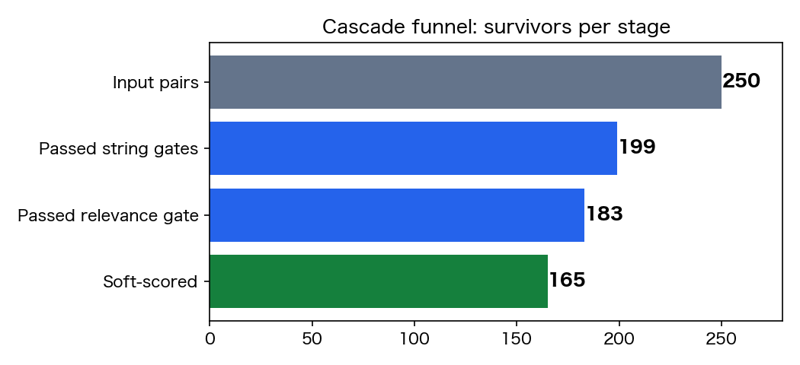
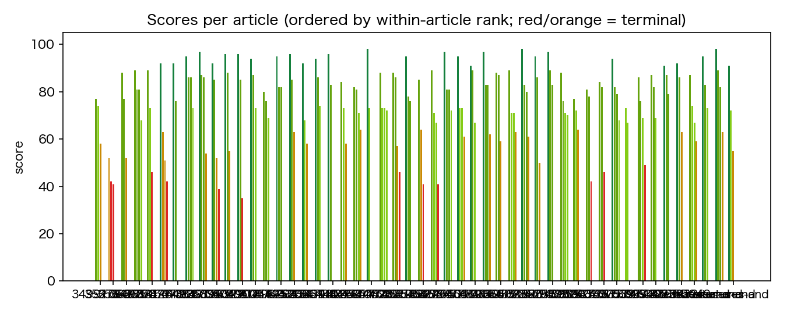
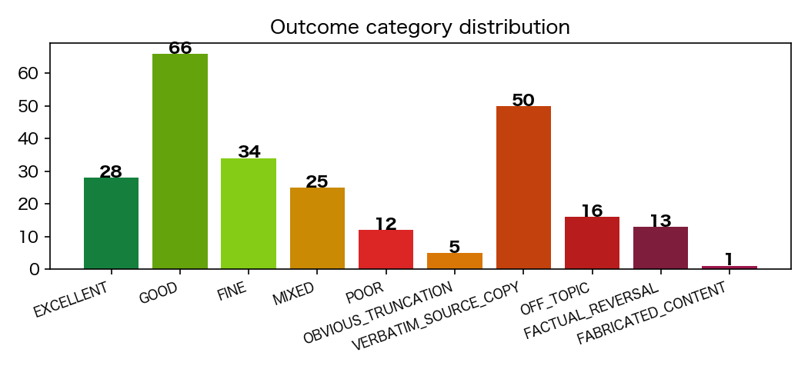
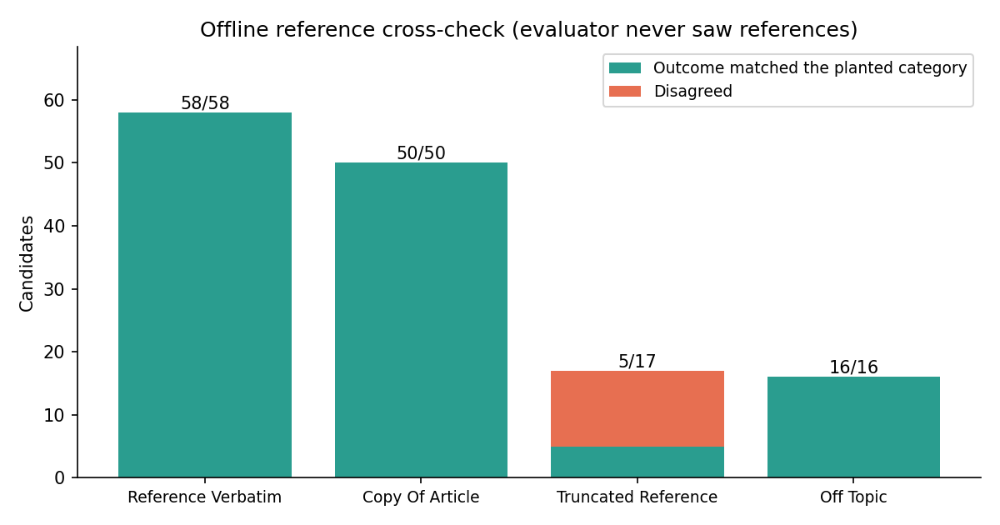

# Summary-Quality Funnel — Run Report (`run_0820_1858`)

## 1. Input

250 pairs: 50 Japanese BBC articles from XL-Sum, five candidate summaries each. A *pair* is one candidate joined to its assigned source article; that article is the only evidence any runtime stage sees. The corpus was sampled deterministically from the XL-Sum test split with **seed=42**, restricted to articles of 300–4,000 characters with a non-trivial reference. Reference summaries were withheld from every runtime stage and opened only here, offline, after all scores were final.

## 2. Funnel outcomes

- **Deterministic string gates** proposed 53 terminations; the reviewer confirmed **51** and rejected 2 truncations whose first sentence still delivered the topic. Survivors: 199.
- **Embedding relevance** (`qwen3-embedding:0.6b`, candidate compared only against its own article) is advisory and never terminates.
- **Grounding Gate agent** judged 199 + the 2 rerouted, proposing 37 NOT_GROUNDED (16 off-topic / 13 reversal / 8 fabrication). The reviewer confirmed **29** and rejected 8 — every one of the 8 FABRICATED_CONTENT proposals fell at this layer. 170 scoring drafts remained.
- **Scorer as backstop** raised 4 further semantic terminations, all on items grounding had cleared. Soft review confirmed 1 and rejected 3 into low scores (41/41/46, all POOR); it also escalated 4 truncation fragments and issued 5 REVISE. **165** pairs were soft-scored.

Cost: 51 of 250 pairs never entered any LLM stage, and 80 of 250 never reached the scorer + reviewer pair, the two most expensive calls. No termination stands without an independent reviewer's confirmation.

## 3. Results

Labels across the 165 survivors: EXCELLENT 28, GOOD 66, FINE 34, MIXED 25, POOR 12. Scores span **35–98**. The 85 terminals sit at 0: VERBATIM_SOURCE_COPY 50, OFF_TOPIC 16, FACTUAL_REVERSAL 13, OBVIOUS_TRUNCATION 5, FABRICATED_CONTENT 1.

Ranking shape: every one of the 50 articles retained 2–4 survivors (4 survivors for 19 articles, 3 for 27, 2 for 4) — no article was wiped out and none passed untouched. Median within-article score spread is 26 points (max 61), so the per-article ranking is genuinely separated rather than flat.

Catches worth naming:

- `34991666_f6f8e339` (0, FACTUAL_REVERSAL) — the perpetrators, dead in the headline, are reported as having fled to another state and still at large.
- `41396293_0c954428` (0, FACTUAL_REVERSAL) — flat negation of the announced dissolution of the lower house.
- `41875333_aa36a21a` (0, FABRICATED_CONTENT) — an invented quotation displaces the central claim the title states; cleared by grounding, caught by the scorer, confirmed on soft review.
- `40490051_5d9feeef` (35, POOR) — five entity/number substitutions (Mosul → northern Syria, male → female bombers, 8,000 → 6,000, 500 → 300), kept in soft scoring because the main event survived.

Reliability control: the data contains 6 byte-identical candidate pairs, scored independently by different scorers; all 6 agreed exactly (82/82, 81/81, 83/83, 71/71, 73/73, 81/81). All 170 scoring drafts summed their four dimensions without error, and all 250 final rows pass schema validation.

## 4. Reference cross-check

Weak labels derived from the corpus, computed offline: 141 of 250 records gradable, 109 generated candidates unlabelled.

- REFERENCE_VERBATIM: 58, all survived (mean 78.64, median 81, range 42–89), detection 1.0.
- COPY_OF_ARTICLE 50/50 and OFF_TOPIC 16/16 terminated, detection 1.0.
- TRUNCATED_REFERENCE: 17, only 5 terminated — detection **0.2941**. This is a definition mismatch rather than a miss: truncation was deliberately changed into a proportional penalty, and only fragments with no usable content terminate, so the label's "expect all terminal" reading no longer matches the rule. The 12 survivors land at 39–70 (mean 59.42, median 61.5), all MIXED/POOR/FINE — clearly under the reference band.
- Agreement with weak labels: 129/141 = **0.9149**. Within-article ordering: 50 comparable articles, **0** with a planted bad candidate at or above its reference.

Two limits. Reference reproductions are *assumed* acceptable even though XL-Sum references are uneven, and the 109 generated candidates carry no label at all, so that share of the corpus is unverifiable here. References were withheld at runtime.

## 5. Conclusion

This is prototype evidence. On one 250-pair Japanese corpus the cascade separated planted degradations from reference-grade text, agreed with weak labels at 0.9149, inverted no within-article ordering, and kept 80 pairs out of the expensive stages. It is not production validation: one corpus, one language, one pass, no human adjudication, and the largest block — 109 generated candidates — has no ground truth whatsoever. The most important next step is to reconcile the truncation rule with its label definition, deciding explicitly whether a topical fragment should terminate or be penalised, and re-measure that category before any threshold here is treated as settled.
