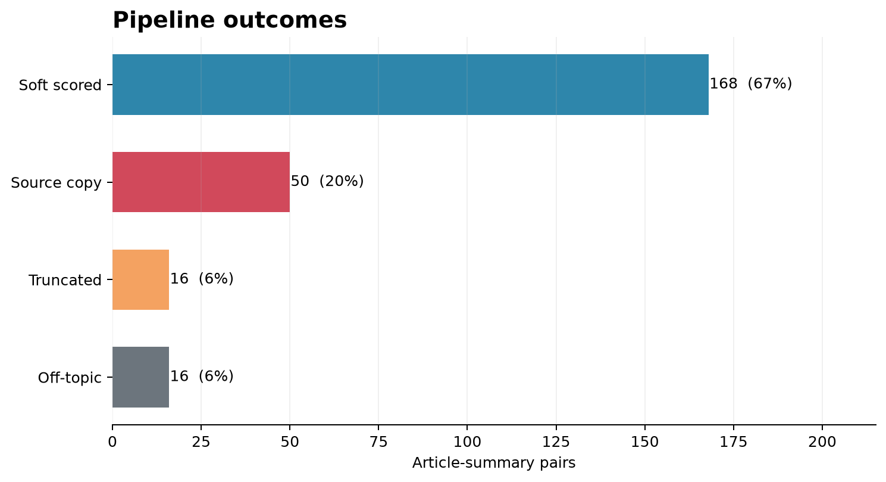
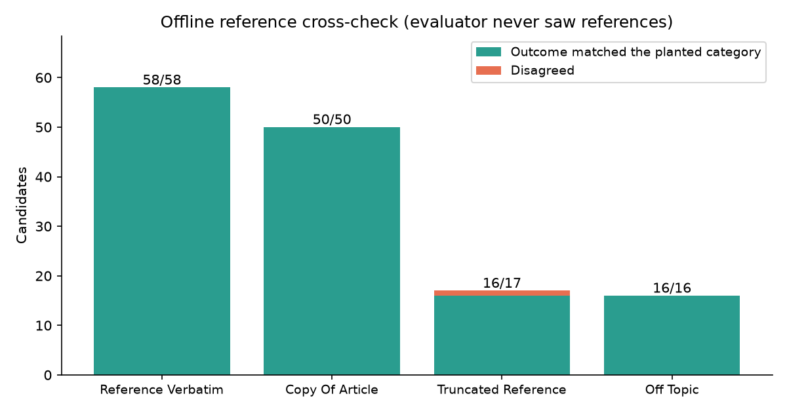

# Summary Quality Evaluation Report

## 1. Input Data

The validated input file `score.jsonl` contains 250 Japanese news article-summary pairs from 50 unique articles. Runtime scoring did not use reference summaries.

## 2. Funnel Outcomes

168 pairs completed soft scoring and 82 stopped early. Terminal outcomes were 50 verbatim source copy, 16 obvious truncation, 16 off-topic. The deterministic gate proposed 53 terminal outcomes, and downstream review recovered 13 additional hard failures. Embedding evidence nominated 19 off-topic suspects; the Reviewer confirmed 16 and rejected 3. Embedding evidence alone was not terminal.

## 3. Results

The 168 soft scores had a mean of 80.43, a median of 85, and a range of 32–100. The label distribution was 65 EXCELLENT, 49 GOOD, 42 MIXED, 12 POOR. Mean dimension scores were 39.12/50 for faithfulness, 21.43/30 for coverage, 14.9/15 for coherence, and 4.98/5 for conciseness.

The Reviewer approved 250 of 250 final records. 230 were approved without revision, 20 required at least one revision, and 0 remained escalated. The highest soft score was 100 for `54083932_011d6de7`; the lowest was 32 for `53174534_48335d13`.

## 4. Reference Cross-Check

Reference summaries were withheld from every runtime stage and are read only here. Labels come from the corpus alone: a candidate contained in its own article is a source copy, a candidate equal to its reference is a reference reproduction, a leading fragment of its reference is a truncation, and a candidate matching a different article is off-topic. 141 of 250 records carry such a label; the remaining 109 generated candidates carry none and are excluded from the accuracy figure.

| Planted category | Candidates | Outcome matched | Surviving score mean | Range |
| --- | ---: | ---: | ---: | ---: |
| Reference summary reproduced verbatim | 58 | 58/58 | 83.29 | 44–98 |
| Continuous copy of the source article | 50 | 50/50 | all scored 0 | all scored 0 |
| Leading fragment of the reference summary | 17 | 16/17 | 74 | 74–74 |
| Unrelated to its assigned article | 16 | 16/16 | all scored 0 | all scored 0 |
| Generated candidate with no derivable label | 109 | not labelled | 78.96 | 32–100 |

The evaluator's outcome matched the planted category for 140 of 141 labelled candidates (99.29 percent). The planted category expected a terminal outcome for one candidate that was instead kept in soft scoring: `51395937_e409196f` at 74. Across the 50 articles holding both a reference reproduction and a planted failure, 0 articles placed a planted failure at or above the reference.

This is weak-label agreement, not validated accuracy. Reference reproductions are treated as acceptable summaries even though the source references are uneven, and the 109 generated candidates that carry the fluent factual errors remain unlabelled.

## 5. Conclusion

Across 250 pairs from 50 articles, the funnel routed 82 candidates to terminal outcomes and soft-scored 168, with downstream review recovering 13 hard failures the deterministic gate missed. The offline cross-check adds the first external evidence: on the 141 candidates the corpus can label, the outcome matched the planted category 140 times, every one of the 58 reference reproductions survived scoring, and no planted failure outscored a reference within its article. This is agreement with weak labels, not calibrated accuracy. The 109 generated candidates carrying fluent factual errors remain unlabelled, references themselves are uneven, and production readiness still requires held-out human judgments across broader domains.
