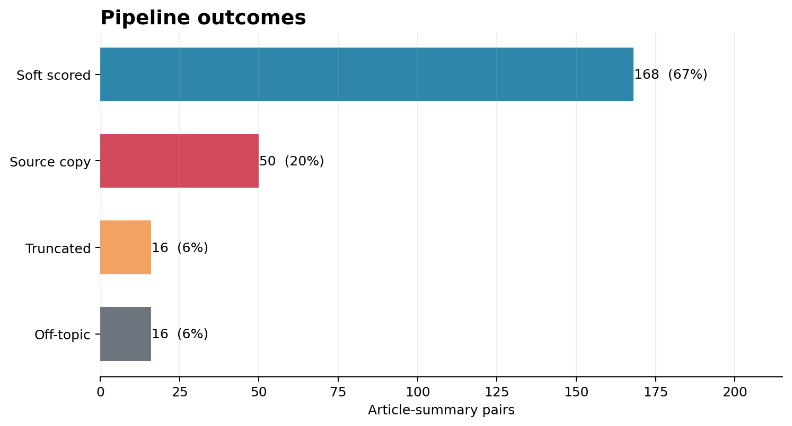
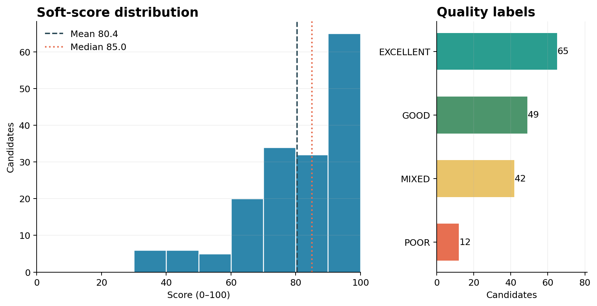

# Summary Quality Evaluation Report

## 1. Input Data

The validated input file `score.jsonl` contains 250 Japanese news article-summary pairs from 50 unique articles. Runtime scoring did not use reference summaries.

## 2. Funnel Outcomes

168 pairs completed soft scoring and 82 stopped early. Terminal outcomes were 50 verbatim source copy, 16 obvious truncation, 16 off-topic. The deterministic gate proposed 53 terminal outcomes, and downstream review recovered 13 additional hard failures. Embedding evidence nominated 19 off-topic suspects; the Reviewer confirmed 16 and rejected 3. Embedding evidence alone was not terminal.

## 3. Results

The 168 soft scores had a mean of 80.43, a median of 85, and a range of 32–100. The label distribution was 65 EXCELLENT, 49 GOOD, 42 MIXED, 12 POOR. Mean dimension scores were 39.12/50 for faithfulness, 21.43/30 for coverage, 14.9/15 for coherence, and 4.98/5 for conciseness.

The Reviewer approved 250 of 250 final records. 230 were approved without revision, 20 required at least one revision, and 0 remained escalated. The highest soft score was 100 for `54083932_011d6de7`; the lowest was 32 for `53174534_48335d13`.

## 4. Conclusion

Across 250 pairs from 50 articles, the results support an auditable staged evaluation prototype: 82 cases received terminal outcomes, 168 received soft scores, and downstream Reviewer recovery identified 13 additional hard failures missed by the deterministic gate, materially strengthening routing coverage. All 250 records were ultimately approved, with 20 revised at least once, but approval denotes completion of the internal audit rather than objective ground-truth accuracy. Because reference summaries were not used, this run does not establish production readiness, calibrated accuracy, or generalization beyond the evaluated corpus; those claims require held-out human judgments across broader domains.
