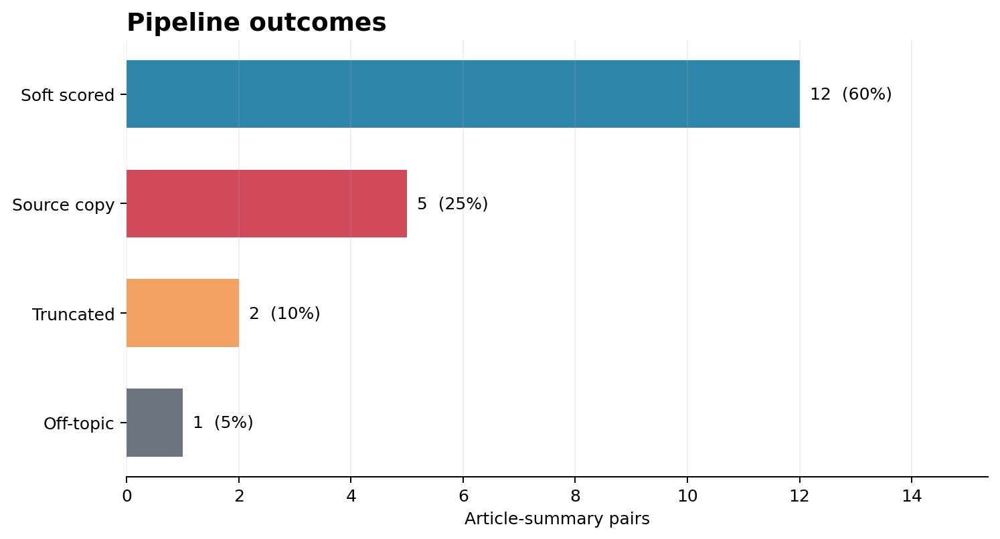
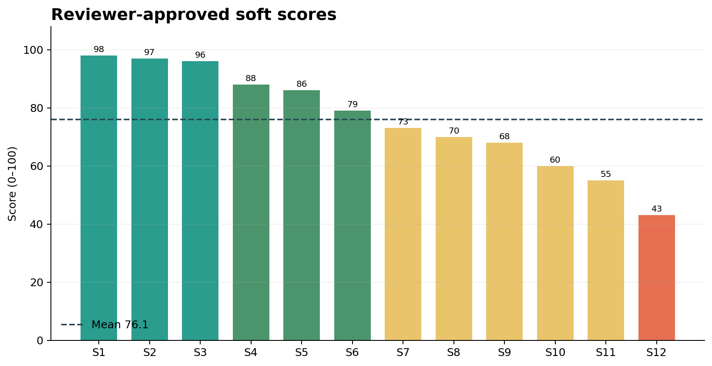

## 1. Input Data

This seed-42 run evaluated 20 Japanese news article-summary pairs from 14 unique articles, using `score_ranked.jsonl` as the validated final artifact. Runtime scoring did not use reference summaries.

## 2. Funnel Outcomes

Twelve pairs completed soft scoring. Eight stopped early: five verbatim source copies, two obvious truncations, and one confirmed off-topic summary. The deterministic gate proposed five terminal outcomes, while downstream checks recovered two additional hard failures. Embedding flagged one off-topic suspect; the pipeline terminated it only after independent semantic review confirmed that its subject and event were unrelated to the assigned article.

## 3. Results

The 12 soft scores averaged 76.08, with a median of 76 and a range of 43–98. The distribution was three EXCELLENT, three GOOD, five MIXED, and one POOR. Mean dimension scores were 35.50/50 for faithfulness, 20.92/30 for coverage, 14.75/15 for coherence, and 4.92/5 for conciseness. The Reviewer approved all 20 final records; three required at least one revision.

A representative success scored 98 after accurately covering the visit to Japan, the speech, and the itinerary. The 43-point failure remained fluent but changed the country, suicide-attacker details, and fighter counts, showing that surface coherence did not mask factual defects.

In the embedding ablation, coverage Spearman correlation increased from 0.5282 for article similarity to 0.6303 for anchor similarity. However, leave-one-out coverage MAE was lowest for article similarity alone (3.6246), versus anchor similarity (4.0123) or both features (4.4121). This small run therefore does not establish a stable predictive gain from anchors.

## 4. Conclusion

This run supports a usable prototype that needs broader validation. The pipeline intercepted clear violations, distinguished fluent factual failures, and produced Reviewer-audited outcomes. The 20-pair sample and mixed ablation evidence are insufficient to establish production readiness, stability, or generalization.
