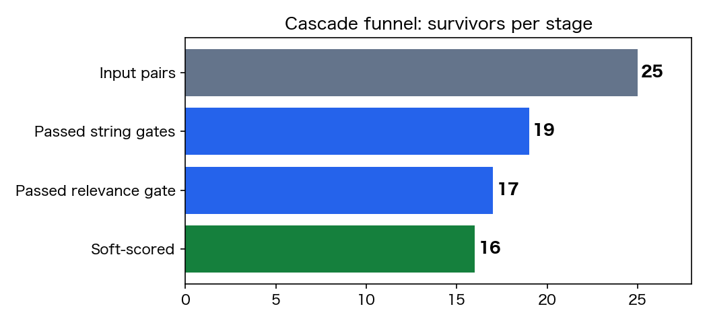
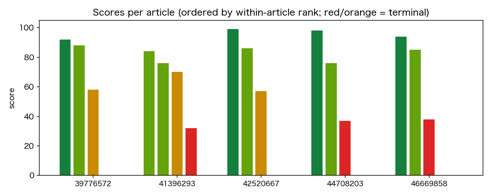
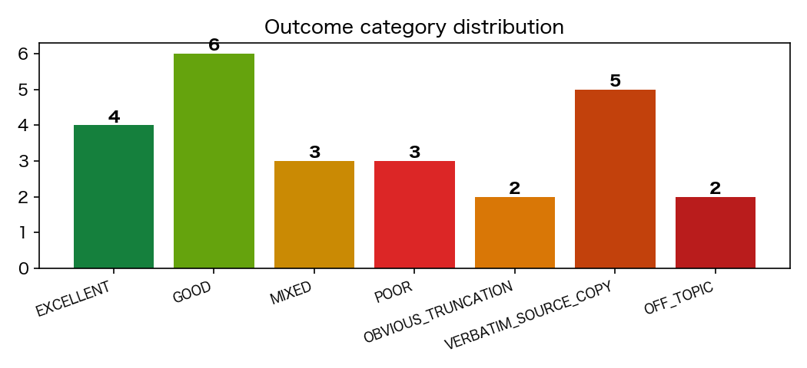

# Summary Quality Funnel — Run Report (25 pairs)

## 1. Input

This run evaluated 25 (article, summary) pairs: 5 Japanese news articles, each paired with 5 candidate summaries, drawn by random sampling with seed=7. A "pair" is one candidate summary judged strictly against its source article — no reference summary was used at any stage. All 25 output records passed `validate_result.py` schema validation before this report was written.

## 2. Funnel outcomes

The funnel runs cheap deterministic checks first and spends LLM calls only on survivors: string hard gates (verbatim-copy, sentence-count, truncation) → embedding relevance gate (qwen3-embedding:0.6b, multi-article retrieval mode) → dual-agent soft scoring (scorer + independent reviewer).

Of 25 pairs, 6 were intercepted by the string hard gates, 2 by the embedding relevance gate as off-topic, and 1 was rerouted to a terminal result by the reviewer, leaving 16 pairs (64%) with finalized soft scores. Terminal results: 5 VERBATIM_SOURCE_COPY, 2 OBVIOUS_TRUNCATION, 2 OFF_TOPIC.

Cost implication: 9 of 25 pairs (36%) terminated early and never consumed a completed soft-scoring pass, so the most expensive stage ran on only 64% of the workload.

The reviewer reroute is worth noting as a defense-in-depth result. Summary 39776572_7682c3a7 ends mid-noun-phrase with no final punctuation, but because it ends in a kana character the deterministic truncation check only registered a weak suspicion and passed it through. The scorer drafted a soft score of 45; the independent reviewer caught the category error, issued ESCALATE_TO_TERMINAL, and the pair was finalized as OBVIOUS_TRUNCATION with score 0 — the layer behind the gate caught what the gate missed.

## 3. Results

Among the 16 soft-scored pairs the label distribution was 4 EXCELLENT, 6 GOOD, 3 MIXED, 3 POOR, with scores ranging from 32 to 99.

The per-article ranking shape is consistent across all 5 articles: each article's top-ranked summary scored 84–99, followed by a mid-tier candidate, then a low-scoring distorted candidate, with terminal-result (score 0) candidates at the bottom. The funnel separated faithful summaries from corrupted ones within every article, not just across the pool.

Concrete catches from the claim checks:

- **Negation flip** — 41396293_0c954428 (score 32, POOR): the article reports Abe announced dissolution and a snap election; the summary states he would *not* dissolve the Diet and would focus on the remaining term. Two CONTRADICTED claims, faithfulness 5/50.
- **State inversion** — 44708203_437c2afb (score 37, POOR): the article reports rescued boys appearing healthy on video; the summary claims they were severely weakened and barely responsive — a direct reversal of the article's central observation.
- **Fabricated casualties and emergency** — 46669858_592c0e2f (score 38, POOR): claims all 5 band members died (the article reports 3 dead, one missing, vocalist survived) and invents a national state of emergency and a military-led rescue operation, neither of which appears in the source.
- **Entity and number substitution** — 42520667_f33c4810 (score 57, MIXED): swaps the protest city Mashhad for Tabriz and inflates arrests from 52 to 72, while the surrounding narrative stays accurate — the subtlest error type in this run, still caught by claim-level verification.

## 4. Conclusion

This run establishes that the funnel architecture works end to end on a small sample: deterministic gates removed degenerate outputs before any LLM spend, the embedding gate removed off-topic pairs, the scorer produced claim-grounded dimension scores, and the independent reviewer corrected the one case that slipped through a hard gate. It does **not** establish production readiness: 25 pairs across 5 articles is prototype evidence, the score thresholds and label boundaries are unvalidated against human judgment, and a single run gives no estimate of scoring variance.

The single most important next step is human-annotation alignment: build a small dev set of human quality labels on held-out pairs and measure agreement (label accuracy, rank correlation per article) before trusting the scores for any downstream decision.

> TODO (future capability, not implemented): corpus self-expansion via web crawling to grow the evaluation set. This requires explicit user authorization plus provenance/licensing review and is out of scope for this run.
