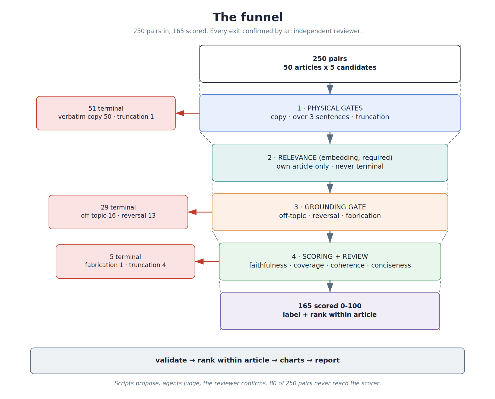
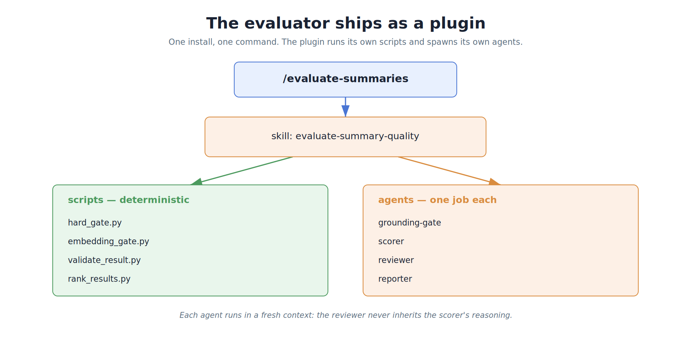
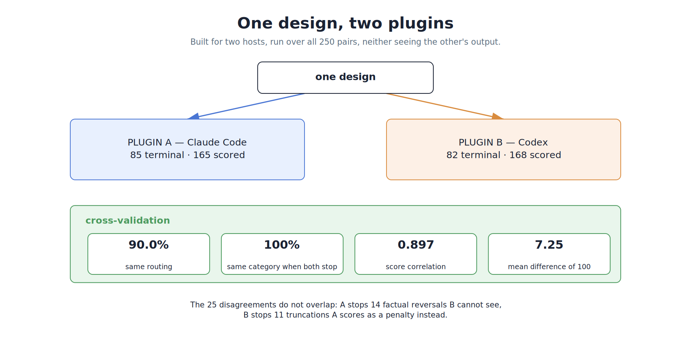

# Evaluating a Japanese News Summarizer

**A reference-free quality funnel, shipped as a plugin, built twice so it could be checked against itself.**

## Summary

**What I built.** A four-band cascade that takes one `(article, candidate)` pair and returns a 0–100 score, a quality label, a within-article rank, a terminal category when the candidate is inadmissible, and a stage-by-stage trace of how it got there. No reference summary enters any runtime stage. It is delivered as an installable plugin — one command runs the whole cascade, spawning its own gate, scorer, reviewer and reporter agents — and the same design was compiled a second time for a different agent host and run again, end to end, over all 250 pairs.

**What it achieves on this corpus.**

| Evidence | Result |
|---|---|
| Agreement with weak labels, on all 141 candidates the corpus can label | **129/141 = 91.5 %** — copies 50/50, off-topic 16/16, all 58 reference-grade candidates kept alive |
| Within-article ordering, all 50 articles | **0 inversions** — no planted failure ever outranked a reference |
| Ordering of the 109 candidates no label can reach, second independent judge | **Spearman 0.956** |
| Routing agreement between two independently built implementations | **225/250 = 90.0 %**, and **71/71 = 100 %** identical category where both stopped |
| Score correlation between them, on the 154 both scored | **Spearman 0.897**, mean absolute difference 7.25 of 100 |
| Test–retest on byte-identical candidate pairs | **6/6 identical scores** |
| Contract compliance | 170 drafts with zero arithmetic errors, 250 records passing schema validation, 0 unresolved escalations |

**What is unusual about it.** Three things, argued in §2 and §3 rather than asserted here. The evaluator is constrained to what a production caller can actually supply, which cost me a working relevance feature and is the reason the numbers above describe a deployable contract rather than a benchmark trick. Admissibility was taken away from the scoring agent and given to an agent that cannot score at all — a decision made because the measurement in §4.3 showed a scoring agent prices central defects instead of stopping them. And the design ships in a form portable enough to be rebuilt for a second host, which is what turned "I believe this design is sound" into 90.0 % agreement between two implementations that share no code.

---

The dataset hands you 250 candidates and, beside them, 50 reference summaries. The single decision that shaped everything here was to refuse the references — because a production request contains an article and a candidate and nothing else, and an evaluator that needs a reference has not been evaluated at all. Everything below follows from taking that seriously, including the places where it forced me to delete my own working code.

---

## 1. What the data taught me

250 candidates over 50 BBC Japanese articles, five per article, methods undisclosed. I read all 250 against their sources rather than sampling — I built a viewer and a translation pass so I could actually read the corpus — and I ran three probes, each of which I expected to answer a question and two of which answered a different one instead.

**Probe 1: how much of this corpus is derived from the reference?** `ref_hit_stats.py` normalises (NFKC, whitespace-stripped) and classifies every candidate against its own article and its own reference.

| What the corpus contains | n | How it is established |
|---|---:|---|
| Reference reproduced verbatim | 58 | exact normalised match to its own reference |
| Continuous copy of the article body | 50 | candidate contained in its own article |
| Leading fragment of the reference | 17 | own reference `startswith` candidate |
| Unrelated to its assigned article | 16 | matches another article's text or reference at ratio ≥ 0.90 |
| Generated, no derivable label | 109 | everything else |

Every article has at least one verbatim reference among its five; eight have two. Two consequences follow, and I only saw them because I read the corpus rather than sampling it. The offline cross-check gets a positive control inside every article. And because a handful of those duplicates are byte-identical texts that were later scored independently by different agents, the corpus quietly contains a test-retest control (§4.5). One more thing worth stating early: my strict labeller finds 50 article copies and my looser 0.90-ratio labeller finds 51. Even the labels are uncertain — which is why §4 never rests on them alone, and why the strongest evidence in this report comes from two implementations rather than from a label file.

**Probe 2: can a cheap signal find the unrelated ones?** I computed the full 250 × 50 cosine matrix with `qwen3-embedding:0.6b`, then asked the same question again with a BGE cross-encoder.

| Detector | Flags | Range on flagged | In the 16-item intersection |
|---|---:|---|---:|
| Own-article cosine < 0.50 | 19 | 0.1303 – 0.4813 | 16 |
| Own article not rank 1 of 50 | 18 | — | 16 |
| Cross-encoder margin < 0 | 16 | — | 16 |

Three unrelated detectors converge on the same 16 candidates, and the 2 GB reranker finds nothing the 0.6 B embedding missed — which retired the reranker before it was ever a design candidate. The probe's real payoff was the boundary it exposed. The lowest own-similarity among candidates whose own article *did* rank first is **0.4939**; confirmed off-topic candidates reach **0.4813**. The two distributions touch. Separately, two calibration experiments (one curated, one seeded random) gave a clean gap — 0.711–0.868 against 0.163–0.398, and 0.707–0.858 against 0.164–0.364 — and yet one article's *own* reference scores 0.459, below any threshold that separates those groups. A number that is right 39 times out of 40 and silently wrong the 40th time is evidence, not a verdict.

**Probe 3: read the 109 that no probe can label.** This is where the problem lives. Fluent, correctly sized, not copied, on topic — and wrong:

- `52000333_4f9df41b` reports a nationwide closure was called off; the article announces it.
- `44708203_437c2afb` describes rescued boys as gravely weakened; the article shows them healthy.
- `41396293_0c954428` flatly negates the dissolution of the lower house the article reports.
- `50469832_8a6e1840` states the real policy shift correctly, then attaches an emergency UN Security Council session and a unanimous resolution that exist nowhere in the source.

**Two hypotheses died here, and their deaths are the design.** The first was that embedding similarity could grade quality. It cannot, and the *direction* of the failure is what matters: a verbatim copy scores highest of all, because copying maximises similarity. In the per-article ranking probe the copy came first again and again — for article `50469832`, the copy at 0.897 above the best genuine summary at 0.851. A metric that rewards the failure mode most is worse than no metric. The second was that references could be the comparator, and killing it is what turned a reference-based ensemble into a reference-free funnel.

**What survived** is one distinction I did not have before reading these: `50469832_8a6e1840` invents a Security Council resolution but reports its main event correctly — delete the invented clause and a usable summary remains; it scored 50. `41875333_aa36a21a` replaces the article's central quotation with an invented one of opposite meaning — delete it and nothing is left; it terminated at 0. Both are fabrication. Only one destroys the output. Conspicuousness is not severity. **Centrality is.**

## 2. Five principles, and the funnel that falls out of them

*Vector: `figures/funnel_pipeline.svg` · editable source: `figures/funnel_pipeline.drawio`. The draw.io file is the single source of truth; `code/figures/render_drawio_svg.py` renders the SVG from it, and the PNG above is that SVG rasterised so it displays in every viewer.*

The funnel is not the design. It is what the design looks like once five commitments are enforced at once. I state them as principles because each one is transferable to an evaluator that has nothing to do with Japanese news.

### P1 — An evaluator may use only what a caller can supply

This is the reference decision, and its interesting half is the second time I applied it. The first version of the relevance band compared a candidate with every article in the batch: own-article retrieval rank, best-matching article, margin against the strongest other article. Strong signals, and inadmissible for exactly the reason references are. A production request supplies one article; a rank against 49 others consumes context the caller never provided, so any recall figure measured that way overstates what the deployed system can do.

So it came out. What I did *not* do is quietly rewrite history: `embedding_drafts.jsonl` from the earlier run still records `mode: multi_article_retrieval` with the three prohibited fields, because that file records what actually ran. I measured the removal before making it — all 16 confirmations were also reached by the single-pair absolute rule, and not one candidate had been nominated by relative evidence alone — so the cost is known to be zero on this corpus, and future runs use the corrected gate.

The same principle retires a category. There is no runtime class for "belongs to another article", however the candidate got there: unrelated to the article in front of you is off-topic and nothing else, judged from the pair alone. The corpus scan that finds those is an offline labelling method, and it is documented as one.

### P2 — Required and authoritative are different properties

The embedding band **must run**: it is the only continuous relevance evidence in the trace, and a run that cannot produce it is incomplete, not cheaper. The embedding band **may never decide**: Probe 2 showed the bands overlap at 0.4813 against 0.4939, and a related summary can sit at 0.459. Most pipelines collapse these two questions — a stage is either trusted and load-bearing, or optional and skippable. Here the stage is mandatory and powerless, and that combination is deliberate. It buys a trace in which every survivor carries a similarity value a reviewer can weigh, without ever letting a cosine end a candidate's life.

### P3 — A stage may conclude only what its instrument can prove

`hard_gate.py` is a measurement instrument that proposes. Its predicates are narrow on purpose:

- **Copy** needs normalised containment at ≥ 30 characters, *or* a longest common substring ≥ 60 characters **and** ratio ≥ 0.90 **and** 12-gram coverage ≥ 0.95. Three simultaneous conditions, so a long shared quotation cannot trip it; shared entities, numbers and stock news phrases stay legal.
- **Sentence count** counts top-level sentences only — terminators inside balanced 「」『』（）【】〈〉 do not split, or Japanese quotation inflates the count into false over-length terminals.
- **Truncation** proposes *only* on a trailing 、，：: or an unclosed delimiter, cases where the measurement is the conclusion. A missing sentence-final character, a bare noun ending, a particle ending, a predicate-less clause: measured, emitted as evidence, handed on.

Truncation is where this principle cost something, and paying it is the point. It was the one place a regular expression was being asked a linguistic question — has this sentence finished? — so the judgment moved to the reviewer, which is reading the text anyway. The bill is 14 of 250 candidates now consuming anchor generation and scoring before terminating, about 6 % of scoring work, and I would rather pay it than let a regex make a judgment it cannot defend.

Testing that decision produced a finding I did not expect, and it is the most interesting thing this band taught me: **part of the truncation class is undecidable from the pair alone.** `〜を発表` is simultaneously ordinary Japanese 体言止め headline register and the residue of cutting `〜を発表した。`, and the only thing that separates them is the deleted text — which a reference-free evaluator does not have and never will. So the class splits in two: endings amputated mid-token (`しかしそ`, `救助し`) are visible in the text and a reviewer can be held to them, while 体言止め endings are a property of the contract, not a defect in the funnel, and must never be scored against the evaluator. Reporting those two groups as one number would be a measurement error, and until this test they were one number.

The earlier run taught me the sharper version of the same lesson. Its deterministic gate proposed only 3 truncations and the run still terminated 16 — the other 13 arrived later, escalated by the soft-score reviewer. And in the run where that number collapsed, the cause was not detection: **four separate reviewer agents identified truncated candidates and correctly declined to act, because truncation was outside their escalation scope.** The capability was present; the permission was missing. In an agent system those are two different failures and they look identical from the outside.

### P4 — Admissibility and quality are different jobs, so they belong to different agents

The most dangerous candidate passes every mechanical test and is on topic, so it lands in soft scoring by construction. My first answer was to let scoring handle it with a faithfulness penalty. That answer is measurably wrong. On the 109 unlabelled candidates, scored under pure soft scoring, **14 of 21 fabrications and 7 of 24 reversals still scored ≥ 65** — the band a reader reads as "usable" (§4.3). An agent that is allowed to grade will grade. It will price a central defect instead of stopping it, because pricing is what it was asked to do.

So admissibility was taken away from the scorer and given to an agent that cannot score at all. The Grounding Gate answers one question — is this candidate grounded in its article? — returns `OFF_TOPIC`, `FACTUAL_REVERSAL` or `FABRICATED_CONTENT` with one cited span from each text, and its isolation is enforced rather than requested: it never receives the anchor or the scoring rubric, it may not see another article, `validate_grounding_outputs.py` rejects any row carrying a score or dimensions, and an uncitable suspicion is `GROUNDED` by rule.

The same principle then makes the reviewer, not the proposer, the last word. Nothing terminates on its own: 53 physical proposals became 51 confirmations, 37 gate proposals became 29, and the scorer keeps both semantic terminals reachable as a backstop for what the gate missed — which fired 4 times and held once. And because roles disagree, the disagreement is preserved rather than averaged: one revision, then `LOW_CONFIDENCE`, never a mean of two opinions.

### P5 — Severity is centrality, and the boundary must be defended from its own agent

Central defect — negated main event, inverted outcome, invented core claim — is terminal. Peripheral defect — wrong secondary entity, wrong peripheral figure, one added unsupported detail — is a faithfulness penalty. The operational test is deletion: remove the defective sentence; does the summary still stand?

Without this line the gate swallows the rubric and every score collapses to 0 or 100. So the boundary is not merely written down, it is defended against the specific way this role fails: the few-shot bank carries a dedicated counter-example, `GROUNDED_PERIPHERAL_DEFECT`, and the gate and reviewer are both told to weigh it hardest, because over-proposing on a striking-but-peripheral invention is the mistake they are most prone to. When a new rule contradicted an existing example — a `FACTUAL_ERROR` few-shot that reversed a central fact while being labelled a soft `POOR` — the example was re-cut rather than left to teach the old boundary.

The rubric that follows is deliberately conventional, because the originality belongs in the routing and not in the scoring sheet: faithfulness 50, coverage 30, coherence 15, conciseness 5, from atomic claims each carrying a cited span and a `SUPPORTED` / `CONTRADICTED` / `NOT_IN_SOURCE` verdict. An article-only anchor (`main_event`, `key_facts`) is generated once per article and cached *before* any candidate is seen, so coverage is measured against a fixed target rather than against whichever candidate was read first — and it is explicitly not ground truth, since a candidate may carry valid source-supported facts the anchor omits. Terminals score 0 but keep severity tiers, so five candidates stay sortable even when several fail: reversal, fabrication, off-topic and empty output at tier 0, copy 1, truncation 2, over-length 3. A summary that states the opposite of its source misleads a reader who cannot check the article, so it must never outrank a copy or a fragment.

### The small mechanisms that stop an agent rubber-stamping

Principles need enforcement at the size of a single call. Faithfulness above 40 with any `CONTRADICTED` claim is an automatic `REVISE`. The reviewer reproduces both cited spans itself, from the article *including its title* — both count as source. Borderline gates are rejected rather than approved, so uncertainty continues the funnel instead of ending a candidate. `validate_result.py` then enforces the contract mechanically: dimensions must sum to the score, terminals must be 0 with `dimensions: null`, tiers must match categories, every terminal needs an `early_stop` event, and any record containing the string `reference_summary` fails outright. `rank_results.py` sorts eligibility, then tier, then score, and preserves evidence-backed ties rather than inventing an order.

### What I rejected, and why

- **A weighted ensemble with a human-annotation term** (human 0.4, expert agent 0.2, claim check 0.2, rules 0.2). A score containing a human term cannot run on new data — the same defect as needing a reference — and demoting the rule layer to a 0.2 voter throws away the one thing it is good at, which is deciding.
- **Full human annotation of all 250**, split dev/held-out, to distil expert rules into a judge prompt. Dropped on cost once the deterministic bands proved they settle a fifth of the corpus alone, and on principle by the same argument as above.
- **References as ground truth.** Attractive, explicitly warned against by the brief, kept only as an offline weak-label check computed after every score was final.
- **The BGE cross-encoder.** Built and run on all 250 rather than argued about: 16/16 agreement with the embedding band, no candidate found that the band missed, at 2 GB and much slower inference. Measuring it is what made dropping it a decision instead of a guess.
- **Anchor embeddings as a scoring feature.** Measured twice, and it did not replicate: one probe had anchor similarity correlating better with coverage than article similarity (Spearman 0.6303 vs 0.5282) but with worse leave-one-out error (MAE 4.0123 vs 3.6246); a second, smaller probe reversed the correlation ordering (0.424 vs 0.512). Mixed twice is a no.
- **A flat 25 % copy penalty**, invented in an early discussion and unsupported by anything in the brief. Withdrawn.

## 3. Why the deliverable is a plugin

*Vector: `figures/plugin_anatomy.svg` · editable source: `figures/plugin_anatomy.drawio`.*

A principle written in a prompt is a convention. A principle written into a host's role and tool boundaries is a property. That distinction is the whole argument for shipping this as a plugin rather than as a script I ran.

Consider what each of §2's commitments needs in order to be true rather than intended. P4 needs the reviewer to be unable to inherit the scorer's reasoning — which a fresh agent context gives and a section break in one long prompt does not. P4 also needs the gate to be unable to score — enforced by keeping the rubric out of its inputs and by a validator that rejects any row carrying a score. P3 needs the deterministic layer to be separable from judgment, which is why gates, validation, ranking and charts are plain scripts and the reporter may only write a conclusion from statistics it is forbidden to compute. P1 needs the reference field to be absent from every runtime input, which `hard_gate.py` strips and `validate_result.py` refuses to let back in.

The purest case is `summary-reviewer-blind`. Its judgment text is a byte-for-byte copy of the ordinary reviewer's, because the reviewer's judgment was the strongest role in the run and I did not want to change it. Only its access changes: it holds `Write` alone — no `Read`, `Grep`, `Glob` — and receives the article inline. It cannot open a corpus that happens to contain reference summaries. That is the difference between forbidding a thing and removing the possibility of it, and it is the reason it exists.

One practical consequence: reproduction is install, then one line. The eleven runtime stages are numbered steps in a skill the plugin loads, so nobody re-drives them by hand and nobody can silently skip one — a claim about the evaluator's behaviour is a claim about an artifact a reader can install.

And one unplanned consequence, which turned out to be the best thing in this project. Because the design lives in a portable form rather than in a notebook, it could be compiled for a second host: a Codex plugin with the same funnel, rubric and output schema, and a different way of declaring and launching roles. What had to be rewritten was the manifest and the role mechanics. What did not was the design. That produced an independent second implementation of the same beliefs — and therefore the strongest validation evidence I have.

## 4. Validation

*Vector: `figures/two_plugins.svg` · editable source: `figures/two_plugins.drawio`.*

Both plugins ran over all 250 pairs. Neither used a reference at runtime; neither saw the other's output.

**4.1 The funnel's own numbers.** 250 → 51 confirmed physical terminals → 199 judged by the gate, 37 proposals, 29 confirmed → 170 scored, 5 terminated late by the backstop → **165 scored, 85 terminal**. Scores span 35–98; labels `EXCELLENT` 28, `GOOD` 66, `FINE` 34, `MIXED` 25, `POOR` 12. Every article retained 2–4 survivors (four for 19 articles, three for 27, two for 4), so no article was wiped out and none passed untouched. 51 pairs never met a model; 80 never reached the scorer.

**4.2 Against weak labels**, derived offline after both runs were final:

| Planted category | n | Expected | Outcome | Result |
|---|---:|---|---|---|
| Reference reproduced verbatim | 58 | survive | 58 survived, mean 78.6 | 58/58 |
| Continuous article copy | 50 | terminal | 50 terminal | 50/50 |
| Unrelated to its article | 16 | terminal | 16 terminal | 16/16 |
| Leading reference fragment | 17 | terminal (old rule) | 5 terminal, 12 scored 39–70 | rule/label mismatch |
| Generated | 109 | — | unlabelled | — |

**129/141 = 91.5 %** on the gradable set, and **0 of 50** articles placed a planted failure at or above its reference. The truncation row is a definition mismatch rather than a silent miss: the current rule says a cut candidate that still reports what the article is about loses coherence instead of routing to zero, so the label's "every fragment terminates" reading no longer describes the rule.

**4.3 A second opinion on the 109 with no label.** The unlabelled block is the design's whole reason for existing, so I had it independently re-scored candidate by candidate, each with a named key issue, and compared with the other implementation's scores.

| Group | n | Auditor mean | Other implementation mean |
|---|---:|---:|---:|
| No issue found | 25 | 96.6 | 98.4 |
| Issue found | 84 | 63.7 | 73.2 |
| — of which contradiction/reversal wording | 24 | 41.0 | 55.1 |
| — of which fabrication wording | 21 | 53.0 | 67.4 |

Spearman **0.956** across all 109, mean absolute difference 8.7, and the other implementation is higher in **100 of 109** — a systematic **+7.7** generosity offset, not noise. Two things follow. The ordering of the unlabelled block reproduces across independent judges, which is what a ranking evaluator actually needs. And the ≥ 65 counts inside that table are the empirical origin of P4: a fluent central defect priced as a score lands in the band a reader trusts.

**4.4 Between the two plugins.**

| Measure | Result |
|---|---|
| Routing agreement | 225/250 = 90.0 % |
| Same terminal category where both stopped | 71/71 = 100 % |
| Score correlation on the 154 both scored | Spearman 0.897 |
| Mean absolute difference | 7.25 of 100 |

The 25 disagreements are the most informative result in this report, because the two sets do not overlap. All 14 that only A terminated are reversals or fabrications, and all 14 are generated candidates — the class B's committed run structurally cannot reach, since it predates the semantic band. All 11 that only B terminated are truncations, and all 11 are reference fragments — A had already turned truncation into a scaled penalty and scored them 39–69. **Every one of the 25 disputed candidates scores below the other implementation's own mean.** The implementations never disagree about which candidates are defective, only about severity, and each disagreement maps onto exactly one dated decision in the log.

**4.5 Reliability, and two defects found by reading artifacts rather than verdicts.** The corpus contains six byte-identical candidate pairs; scored independently by different agents, all **6/6 returned identical scores** (82/82, 81/81, 83/83, 71/71, 73/73, 81/81). All 170 scoring drafts summed their dimensions without error; all 250 records passed schema validation. Then: the grounding-review batches had been built without the article title, so a reviewer audited the gate with less evidence than the gate had and threw out a valid reversal — the scorer's backstop re-raised it and soft review confirmed it once the title was in scope. And a draft whose trace jumped from `embedding_relevance` straight to `draft_scoring` revealed that the gate and scorer had been launched in parallel, leaving `eligible_for_soft_scoring` unreproducible from its own trace. Both are arguments for the trace being the deliverable it is.

**What the four lines buy, together.** Weak labels show the funnel catches what the corpus can prove was planted. §4.3 shows the block the corpus cannot label is nevertheless ordered reproducibly by independent judges — the part a ranking evaluator actually needs. Within-article ordering shows the scores answer the question the product asks: which of these five is better. And cross-implementation agreement shows the numbers are a property of the design rather than of one host's quirks, which is the claim a single run can never support however good its statistics are. Four independent angles, agreeing.

## 5. What this establishes, and what comes next

Across 250 pairs the funnel separated planted degradation from reference-grade text at **91.5 %** agreement on every candidate the corpus can label, inverted the within-article ordering in **0 of 50** articles, reproduced the ordering of the unlabelled block at **Spearman 0.956** under an independent second judge, and agreed on routing with a second, independently built implementation **90.0 %** of the time — choosing the identical failure category in **71 of 71** cases where both stopped. Its failure modes are known by name, and each one has a measurement attached to it. That is the useful state for an evaluator to be in.

**The one open item inside the current design is the relevance band's marginal value.** P2 makes the embedding stage required and never authoritative, and on this corpus every confirmed off-topic candidate was also reachable without it. So the band's contribution is asserted by design rather than measured: what it saves in review traffic, and whether the gate's precision changes when it runs blind, are unknown. The ablation is one run — the same 250 pairs with the band disabled, comparing gate proposals, confirmations and reviewer load — and it is the first thing I would do next.

Everything else is a next experiment rather than a defect:

1. **Human adjudication.** Within-article ranking agreement against human labels, and precision/recall per terminal category. This is the rung above §4.3, which is agreement between model judges with a measured +7.7 generosity offset.
2. **The blind reviewer's delta.** `summary-reviewer-blind` exists precisely so that the reference-free guarantee becomes a property rather than a convention; re-adjudicating the 85 terminal decisions with it turns that from a design intention into a number.
3. **Controlled perturbations.** Numbers, entities, negation, causality and truncation injected deliberately, which converts the taxonomy in §1 from discovered to measured.
4. **Isolating host from version.** Re-run plugin B on the current design so the 25 disagreements measure the host rather than the two dated rule changes they currently encode.
5. **Threshold portability.** The 0.50 relevance threshold is calibrated for this model, language and article representation; recalibration is required before any of the four changes.

**Verdict: a funnel whose behaviour is characterised on this corpus from four independent directions, built twice and audited against itself — a prototype ready for held-out and human validation rather than one waiting for a first result.**
