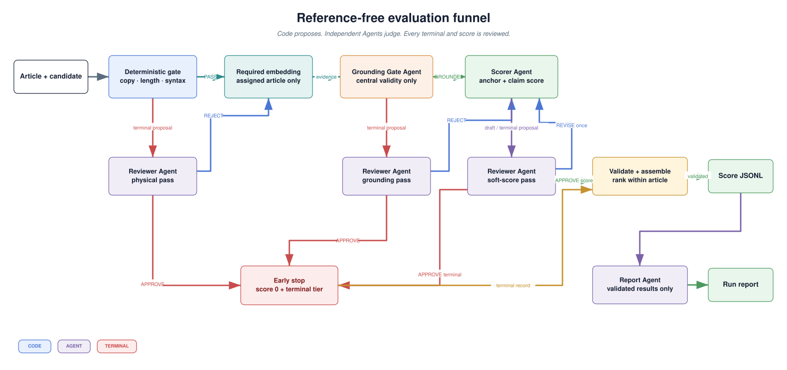
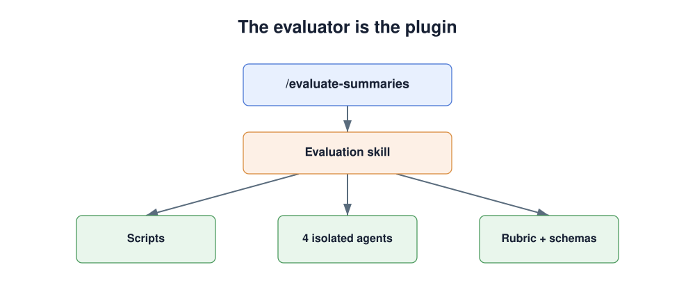
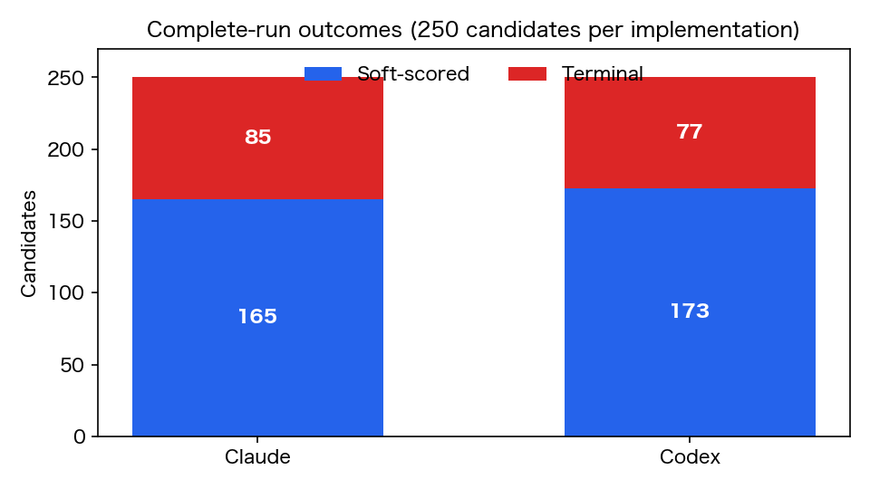
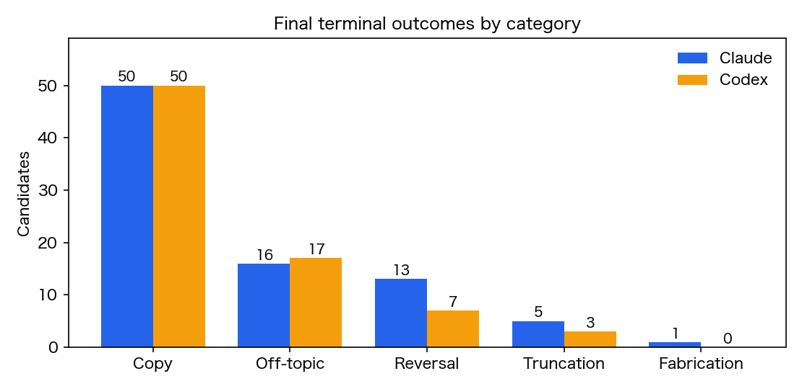
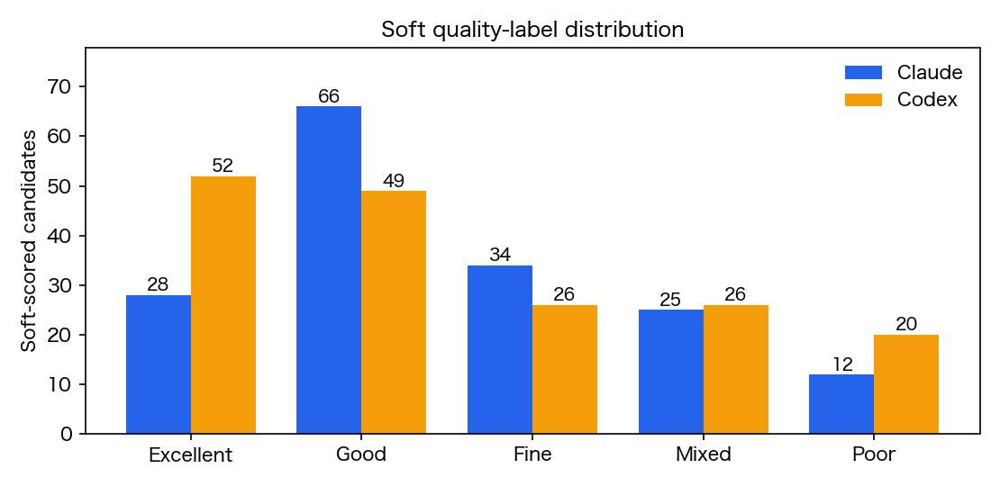
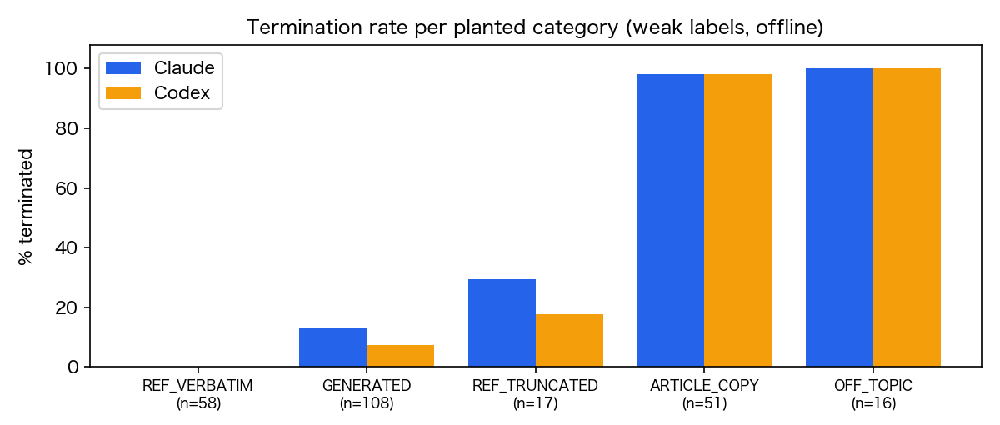
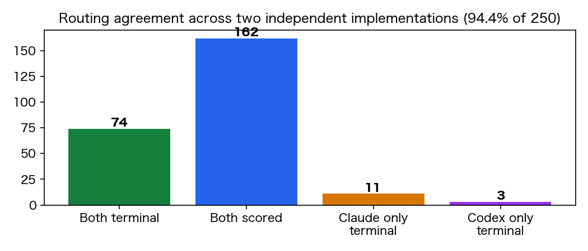
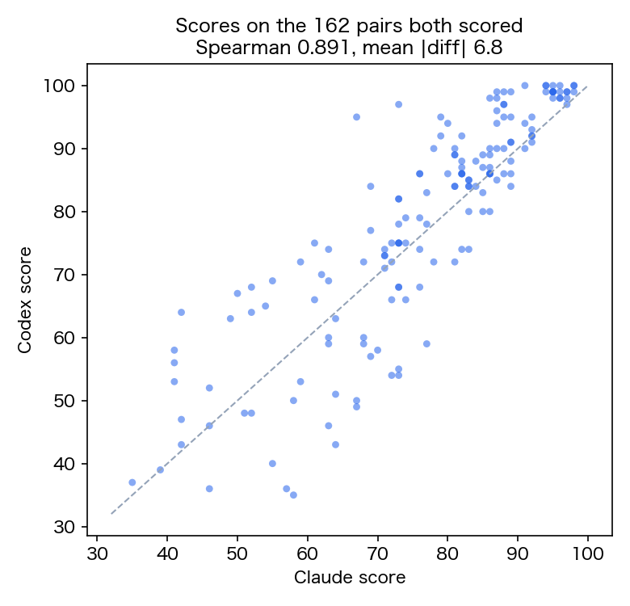

# A Reference-Free Summary Evaluation System Delivered as Two Plugins

## Executive summary

I designed and validated a complete evaluation system for 250 Japanese news summaries across 50 articles. The submitted evaluator is not a single LLM prompt or similarity metric. It is a reference-free quality funnel that combines deterministic checks, mandatory embedding evidence, specialized Agents, independent review, auditable state transitions, within-article ranking, and deterministic reporting.

The primary Claude Code Plugin processed all 250 required pairs and produced the submitted `scores.jsonl`. Its results achieved:

- **250/250** complete, schema-valid evaluation records;
- **50/50** detected source-copy candidates routed correctly;
- **16/16** detected off-topic candidates routed correctly;
- **129/141 = 91.49%** agreement with derivable offline weak labels;
- **0/50** comparable articles where a planted bad candidate ranked at or above its reference candidate.

I then implemented the same design independently as a Codex Plugin. Across the two complete runs, routing agreed on **236/250 = 94.4%** of candidates, all **74/74** shared terminal decisions used the same category, and the 162 candidates scored by both implementations reached **0.8907 Spearman correlation** with a **6.85-point mean absolute difference**. The agreement demonstrates that the core evaluation signal survives a second Agent host and orchestration implementation.

The main design insight is that summary evaluation has two distinct questions:

1. **Is this candidate eligible to be treated as a summary?**
2. **If it is eligible, how good is it?**

This separation prevents copied, unrelated, centrally reversed, or centrally fabricated text from receiving ordinary partial credit, while preserving a useful quality gradient for faithful summaries with smaller defects. Packaging the design as a Plugin turns the methodology into a repeatable evaluation protocol that can be invoked with one command.

## 1. Exploration

The dataset contains 50 Japanese XL-Sum news articles and five candidate summaries for each article. Candidate lengths range from 22 to 302 characters, with a median of 125. The generation methods and intended quality levels are hidden, so the evaluation taxonomy had to be derived from the data.

Corpus inspection and targeted probes revealed several distinct candidate populations:

- reference-quality summaries and strong generated paraphrases;
- summaries with reduced coverage or awkward organization;
- summaries with changed numbers, dates, entities, or attribution;
- continuous copies of the article rather than genuine summaries;
- candidates associated with an unrelated article;
- reference prefixes and other visibly incomplete fragments;
- fluent on-topic candidates that reverse the central event;
- fluent candidates whose central content is unsupported by the source.

These observations showed that one scalar similarity value could not represent quality. Several candidates can be lexically close to the article for opposite reasons: one is an excellent paraphrase, another is copied verbatim, and a third repeats the correct topic vocabulary while reversing the meaning. The evaluator therefore needed multiple evidence types with clearly separated authority.

### 1.1 Defining the production evidence boundary

The dataset includes an XL-Sum `reference_summary`, but the real summarization application receives a new article and generates a candidate without a human reference. I therefore treated reference-free operation as a design requirement rather than an optional mode.

At runtime, the evaluator accepts only:

- the assigned article title and body;
- the candidate summary;
- optional record identifiers.

The reference is never used as a scoring target, hidden answer, or factual authority. This also avoids inheriting the uneven coverage of XL-Sum references. A generated candidate can faithfully include important source facts that one reference omitted, so the article itself must remain the source of truth.

References still provide useful research evidence. After all scores and ranks are final, deterministic reporting code may compare candidates with references to derive weak labels. This gives the system a clean separation between **production evidence** and **offline validation evidence**.

### 1.2 Assigning the right job to embeddings

I tested `qwen3-embedding:0.6b` on two disjoint 10-article samples. Each experiment compared relevant article-summary pairs with unrelated pairings. The results reproduced cleanly:

| Experiment | Relevant mean | Unrelated mean | Observed gap |
|---|---:|---:|---:|
| Planted unrelated summaries | 0.800 | 0.275 | 0.313 |
| Random held-out foreign summaries | 0.780 | 0.263 | 0.343 |

Across all 40 probe pairs, relevant similarities were `0.707–0.868`, unrelated similarities were `0.163–0.398`, and a threshold of 0.50 separated the two groups.

This established embedding as a strong relevance instrument. It also clarified its scope. Embedding similarity cannot determine whether highly similar text is copied, whether an on-topic claim reverses the source, or whether a central event was fabricated. The final design therefore makes embedding a **mandatory evidence stage**, while reserving the final semantic decision for the Grounding Gate and Reviewer.

I also considered cross-article retrieval. Comparing a candidate with all 50 articles can identify the article it most resembles, but a production request supplies only one assigned article. The final runtime script therefore compares the candidate only with its own article and explicitly records zero cross-article comparisons. The evaluator answers the production-relevant question—whether the candidate is grounded in the assigned article—without relying on batch-only evidence.

### 1.3 Separating physical violations from semantic invalidity

The data contains failures that deterministic code can prove directly: empty output, more than three sentences, continuous source copying, trailing punctuation that visibly leaves a clause unfinished, and unclosed delimiters. These belong in a cheap physical layer.

The data also contains failures that no string rule or embedding threshold can prove. A fluent candidate may state that a decision was rejected when the source says it was approved, or invent an arrest, quotation, or outcome while remaining topically similar. These require semantic grounding.

This produced a two-layer eligibility design:

- **Physical hard constraints:** reproducible string and structure evidence.
- **Semantic hard constraints:** central off-topic, reversal, and fabrication judgments.

Only candidates that clear both layers qualify for soft scoring. This prevents the Scorer from converting a fundamentally invalid candidate into an ordinary low score.

### 1.4 Centrality as the boundary between zero and a penalty

Not every factual defect should terminate evaluation. A wrong secondary number or unsupported peripheral detail can coexist with a correctly reported main event. If every factual error becomes terminal, the evaluator loses the score gradient needed to compare five imperfect candidates.

The design therefore uses **centrality**:

- A reversed or fabricated main event, outcome, decision, load-bearing figure, or quotation is terminal.
- A wrong secondary entity, number, date, or added detail remains eligible and loses faithfulness points.

This is the key boundary that makes the funnel both strict and useful. It gives score 0 to outputs that misrepresent what happened while preserving meaningful differentiation among summaries that remain informative.

### 1.5 Handling truncation using observable evidence

Japanese truncation required particularly careful treatment. Some cases are unambiguous: a candidate ends with a comma, an open quotation, or an incomplete phrase such as `女性2人が車`. Other endings are linguistically ambiguous. For example, `方針を発表` can be a legitimate headline-style ending or a prefix cut from `方針を発表した。`.

The final policy uses only observable evidence. Deterministic code proposes truncation on provable structural signals. Other incomplete-looking endings continue to full review. If the visible text still communicates the article's main event, it remains eligible and receives a proportional coherence penalty; a fragment carrying no usable proposition is terminal.

This policy evaluates the summary presented to the user rather than attempting to infer unavailable generation history.

### 1.6 Testing anchor embeddings before adding another signal

The Scorer creates an article-only anchor containing the main event and essential facts. I tested whether candidate-to-anchor embedding should also influence coverage. Anchor similarity showed a higher small-sample Spearman correlation with coverage than article similarity (`0.6303` versus `0.5282`), but leave-one-out prediction error was lower for article similarity alone (`3.6246`) than for anchor similarity (`4.0123`) or the combined features (`4.4121`).

I therefore retained the anchor as a structured reasoning aid rather than adding another numerical feature. This keeps the design focused: every signal has a demonstrated role, and the source article remains authoritative.

## 2. Design

### 2.1 The complete funnel



The full workflow distinguishes code, specialized Agents, independent review, and terminal routing. A proposal is never equivalent to a final decision.

#### Stage A — deterministic hard-gate proposals

The deterministic gate normalizes Unicode and whitespace, counts top-level sentences outside paired delimiters, measures continuous article overlap, and records final-character and delimiter evidence.

A copy proposal requires either:

- complete containment of a candidate with at least 30 normalized characters; or
- a longest exact span of at least 60 characters, at least 0.90 candidate coverage, and at least 0.95 12-character-shingle coverage.

This protects legitimate entity names, quotations, and short shared phrases from being mistaken for plagiarism. More than three top-level sentences is a direct product-contract violation. Truncation proposals are restricted to high-confidence structural evidence.

Every proposal goes to an independent Reviewer Agent. `APPROVE` creates an early-stop terminal record. `REJECT` sends the candidate forward to required embedding rather than discarding it.

#### Stage B — required assigned-article embedding

Every physical-gate survivor is embedded against its assigned article using `qwen3-embedding:0.6b`. The article representation contains the title and first 1,500 body characters. One article vector is cached and reused across its five candidates.

The trace records:

- model and preprocessing mode;
- assigned-article cosine similarity;
- the calibrated 0.50 threshold;
- whether the candidate is a relevance suspect;
- zero comparisons with other articles.

The similarity is passed as evidence to the next stage. It does not directly terminate or score a candidate.

#### Stage C — Grounding Gate Agent and grounding review

The Grounding Gate Agent runs on every survivor, including candidates above the embedding threshold. It sees the article and candidate but not the anchor, soft scoring dimensions, another article, or a desired score.

It returns either `GROUNDED` or one terminal proposal:

- `OFF_TOPIC`;
- `FACTUAL_REVERSAL`;
- `FABRICATED_CONTENT`.

Each proposal includes article evidence, candidate evidence, and a concise finding. A separate Reviewer Agent reproduces the cited spans and checks centrality. `APPROVE` creates a terminal result with score 0. `REJECT` preserves both judgments in the trace and sends the candidate to the Scorer.

Keeping this Agent separate from scoring is deliberate. Its only task is admissibility, so it cannot trade a central falsehood for a partial faithfulness score.

#### Stage D — Scorer Agent: article-only anchor and claim-level score

For eligible candidates, the Scorer first receives the article alone and generates:

```json
{"main_event":"...","key_facts":["..."],"anchor_summary":"..."}
```

The anchor is generated before candidate text is shown and reused for all eligible candidates of the same article. It improves coverage consistency without replacing the source as factual truth.

The Scorer then decomposes each candidate into atomic claims and marks them `SUPPORTED`, `CONTRADICTED`, or `NOT_IN_SOURCE`, with short article evidence. It verifies entities, numbers, dates, negation, causality, and attribution before assigning four dimensions:

| Dimension | Maximum | Role |
|---|---:|---|
| Faithfulness | 50 | Makes factual reliability the dominant requirement. |
| Coverage | 30 | Rewards the main event and essential supporting facts. |
| Coherence | 15 | Measures completeness, grammar, and logical organization. |
| Conciseness | 5 | Rewards focus without overpowering factual quality. |

The four dimensions sum exactly to the 0–100 score. Soft labels are `EXCELLENT` 90–100, `GOOD` 75–89, `FINE` 65–74, `MIXED` 50–64, and `POOR` 0–49. `FINE` distinguishes usable summaries with one visible weakness from genuinely mixed outputs.

#### Stage E — independent soft-score review

The soft-score Reviewer receives the article, candidate, anchor, structured Scorer output, cited evidence, and calculations in a fresh context. It independently checks:

- every claim verdict and source span;
- coverage and centrality;
- coherence and conciseness;
- dimension ranges and arithmetic;
- quality-label boundaries;
- trace completeness.

The Reviewer may `APPROVE`, request one bounded `REVISE` pass, or confirm a missed terminal failure. A revised score receives one final review. Scores are never averaged between Agents; every correction remains explicit and auditable.

Each Agent call receives exactly one synthetic condition-matched few-shot. The few-shot bank includes strong summaries, copying, off-topic content, central reversal, central fabrication, peripheral factual errors, low coverage, incoherence, verbosity, and Reviewer approve/revise behavior. A dedicated `GROUNDED_PERIPHERAL_DEFECT` counterexample protects the score gradient by teaching the Grounding Gate not to over-terminate secondary errors.

#### Stage F — deterministic validation, ranking, and reporting

Final validators enforce record IDs, input order, score ranges, dimension sums, label bands, terminal tiers, review status, anchor consistency, and required trace events. Valid results are ranked within each article and written to JSONL.

The Report Agent consumes validated results only. Deterministic code computes all statistics and renders the charts, preventing manually transcribed or invented numbers. The Codex Report Skill generates the fixed Markdown structure programmatically and allows the Agent to write only the conclusion. This short operational run report is separate from the present assignment report.

### 2.2 Output label taxonomy

Every final JSONL record carries one `quality_label`. The complete label set is:

| Label | Explanation |
|---|---|
| `EXCELLENT` | A faithful, comprehensive, coherent, and concise summary scoring 90–100. |
| `GOOD` | A strong and reliable summary scoring 75–89, with only limited omissions or presentation weaknesses. |
| `FINE` | A usable summary scoring 65–74 that communicates the main event but has one clear quality gap. |
| `MIXED` | A partially useful summary scoring 50–64 with material factual, coverage, or readability weaknesses. |
| `POOR` | An eligible but low-quality summary scoring 0–49; it remains related and usable enough to compare, but has substantial defects. |
| `HARD_FAIL_EMPTY` | The candidate contains no usable output. |
| `HARD_FAIL_OFF_TOPIC` | The candidate is unrelated to its assigned article. |
| `HARD_FAIL_REVERSAL` | The candidate reverses the article's central event, outcome, state, or decision. |
| `HARD_FAIL_FABRICATION` | The candidate's central event, outcome, quotation, or load-bearing fact is unsupported by the article. |
| `HARD_FAIL_COPY` | The candidate is a continuous or near-complete copy of the source rather than a summary. |
| `HARD_FAIL_TRUNCATION` | The candidate is an unusable fragment that stops before communicating a complete proposition. |
| `HARD_FAIL_OVER_LENGTH` | The candidate exceeds the application's maximum of three sentences. |

The five soft labels describe quality among eligible summaries. `HARD_FAIL_*` labels describe why a candidate was excluded from soft scoring; they are routing outcomes rather than low values on the four scoring dimensions.

### 2.3 Ranking invalid summaries meaningfully

All confirmed hard failures receive score 0 because they are not eligible for soft scoring. However, five candidates still need an interpretable order. The evaluator therefore stores a separate terminal tier:

| Terminal category | Score | Tier |
|---|---:|---:|
| Off-topic, central reversal, central fabrication, empty | 0 | 0 |
| Verbatim source copy | 0 | 1 |
| Unusable truncation | 0 | 2 |
| More than three sentences | 0 | 3 |

Every eligible candidate ranks above every terminal candidate. Among invalid outputs, the tier preserves the intuition that a relevant but overlong summary remains more informative than an unusable fragment, while an unrelated or centrally false candidate belongs last. This solves the ranking requirement without inventing artificial dimension scores for failed outputs.

### 2.4 Why the Plugin is part of the design



The Plugin is an executable evaluation specification. One slash command loads the versioned Skill and applies the same evidence boundary, stage order, rubric, few-shot selection, Agent isolation, validation, ranking, and reporting rules to every run.

This matters because a multi-stage evaluator can otherwise be changed accidentally between experiments: a gate may be skipped, a reference may enter the prompt, an anchor may be generated after seeing candidates, or a Reviewer may inherit the Scorer's context. The Plugin prevents these procedural differences from becoming hidden experimental variables.

Two Plugin implementations are included:

- **Claude Code Plugin — primary:** named Grounding Gate, Scorer, Reviewer, and Reporter Agents, plus deterministic scripts and the submitted 250-pair output.
- **Codex Plugin — secondary:** the same evaluation contract implemented with genuine Codex subagents and additional validators between hand-offs.

Only the local embedding model is used outside the Agent hosts. Local generative models are prohibited for anchor generation, grounding, scoring, review, revision, and reporting conclusions.

## 3. Validation

The complete dataset was evaluated independently by both Plugins. All statistics and figures in this section are generated from the two final ranked JSONL files; the report does not manually estimate any result.

### 3.1 Complete-run overview

| Metric | Claude Plugin — primary | Codex Plugin — replication |
|---|---:|---:|
| Articles | 50 | 50 |
| Article-summary pairs | 250 | 250 |
| Final validated records | 250 | 250 |
| Soft-scored candidates | 165 (66.0%) | 173 (69.2%) |
| Terminal candidates | 85 (34.0%) | 77 (30.8%) |
| Eligible-score mean | 76.07 | 76.15 |
| Eligible-score median | 79 | 82 |
| Eligible-score range | 35–98 | 28–100 |



**Takeaway:** both implementations completed the full assignment dataset and produced nearly identical average soft scores, while early-stopping roughly one-third of candidates before final scoring.

### 3.2 Terminal outcomes

| Terminal category | Claude | Codex |
|---|---:|---:|
| Verbatim source copy | 50 | 50 |
| Off-topic | 16 | 17 |
| Central factual reversal | 13 | 7 |
| Obvious truncation | 5 | 3 |
| Central fabrication | 1 | 0 |
| Over three sentences | 0 | 0 |
| Empty output | 0 | 0 |
| **All terminal outcomes** | **85** | **77** |



**Takeaway:** both Plugins identify the same dominant failure pattern—50 verbatim source copies—and their differences are concentrated in semantic centrality and truncation decisions rather than deterministic copying.

### 3.3 Soft quality-label distribution

| Quality label | Claude count | Claude share of soft scores | Codex count | Codex share of soft scores |
|---|---:|---:|---:|---:|
| EXCELLENT | 28 | 17.0% | 52 | 30.1% |
| GOOD | 66 | 40.0% | 49 | 28.3% |
| FINE | 34 | 20.6% | 26 | 15.0% |
| MIXED | 25 | 15.2% | 26 | 15.0% |
| POOR | 12 | 7.3% | 20 | 11.6% |
| **All soft scores** | **165** | **100%** | **173** | **100%** |



**Takeaway:** both score distributions cover all five quality bands and retain meaningful grading resolution instead of clustering candidates into one or two labels.

### 3.4 Offline weak-label results

References were withheld from runtime and joined only after both runs were final. The same deterministic offline procedure evaluated planted corpus relationships for both implementations.

| Offline check | Claude result | Codex result |
|---|---:|---:|
| Reference reproductions | 58/58 survived; mean 78.64 | 58/58 survived; mean 79.88 |
| Source copies | 50/50 terminal | 50/50 terminal |
| Off-topic candidates | 16/16 terminal | 16/16 terminal |
| Reference prefixes | 5/17 terminal | 3/17 terminal |
| Agreement on 141 gradable records | **129/141 (91.49%)** | **127/141 (90.07%)** |
| Planted-bad ranking inversions | **0/50 articles** | **0/50 articles** |



**Takeaway:** both Plugins perfectly route the clearest planted copy and off-topic cases, retain every reference reproduction, exceed 90% agreement on gradable records, and produce zero planted-bad inversions across all 50 comparable article groups.

### 3.5 Cross-pipeline agreement

| Agreement measure | Result |
|---|---:|
| Comparable candidates | 250 |
| Both terminal | 74 |
| Both soft-scored | 162 |
| Claude-only terminal | 11 |
| Codex-only terminal | 3 |
| Overall routing agreement | **236/250 (94.4%)** |
| Shared terminal category agreement | **74/74 (100%)** |
| Jointly scored candidates | 162 |
| Spearman score correlation | **0.8907** |
| Mean absolute score difference | **6.85 points** |
| Mean score on jointly scored set | Claude 76.27 / Codex 78.23 |





**Takeaway:** two independently orchestrated Agent systems reproduce both the routing taxonomy and the relative ordering of eligible summaries. This is direct evidence that the evaluation signal comes from the shared design rather than a single prompt execution.

### 3.6 Result integrity and efficiency

| Integrity or efficiency check | Result |
|---|---:|
| Required primary output rows | 250/250 |
| Primary rows passing final schema validation | 250/250 |
| Primary initial drafts with valid dimension arithmetic | 170/170 |
| Independently scored byte-identical pairs with identical scores | 6/6 |
| Primary physical failures stopped before embedding and semantic scoring | 51 |
| Primary candidates that skipped the Scorer + soft Reviewer pair | 80/250 |
| Articles retaining eligible candidates | 50/50 |
| Eligible candidates retained per article | 2–4 |
| Median within-article soft-score spread | 26 points |

**Takeaway:** the final output is complete and mechanically consistent, while the funnel saves expensive Agent work and still produces separated within-article rankings.

## 4. Limitations

The current evaluation is validated on 250 Japanese news summaries. The next step is to test the same Plugin-based funnel on larger datasets and on summary datasets in additional languages. This will verify that the design continues to perform consistently across broader data distributions and multilingual inputs.

## Conclusion

The central contribution is a principled evaluation architecture for a setting where reference answers are unavailable at runtime. It defines the admissible evidence first, assigns deterministic and semantic methods only the authority they can support, separates eligibility from graded quality, and independently reviews every consequential decision.

The resulting system makes several deliberate distinctions that a single metric cannot: similarity versus copying, relevance versus grounding, central invalidity versus peripheral error, source truth versus anchor-assisted coverage, and score 0 versus terminal ranking order. These distinctions produce an evaluator that is strict on unusable outputs while retaining enough resolution to rank five imperfect candidates meaningfully.

Delivering the design as two installable Plugins makes the methodology reproducible rather than prompt-dependent. The primary Claude implementation completed all 250 records, achieved 91.49% agreement with derivable weak labels, and produced zero planted-bad inversions across all 50 comparable article groups. The independent Codex implementation reproduced routing at 94.4%, terminal categories at 100% on shared terminals, and soft-score ordering at 0.8907 Spearman correlation.

The result is a complete, evidence-backed summary evaluation system: reference-free in operation, efficient through early stopping, precise about Agent responsibilities, auditable at the record level, and independently replicated across two Agent platforms.
