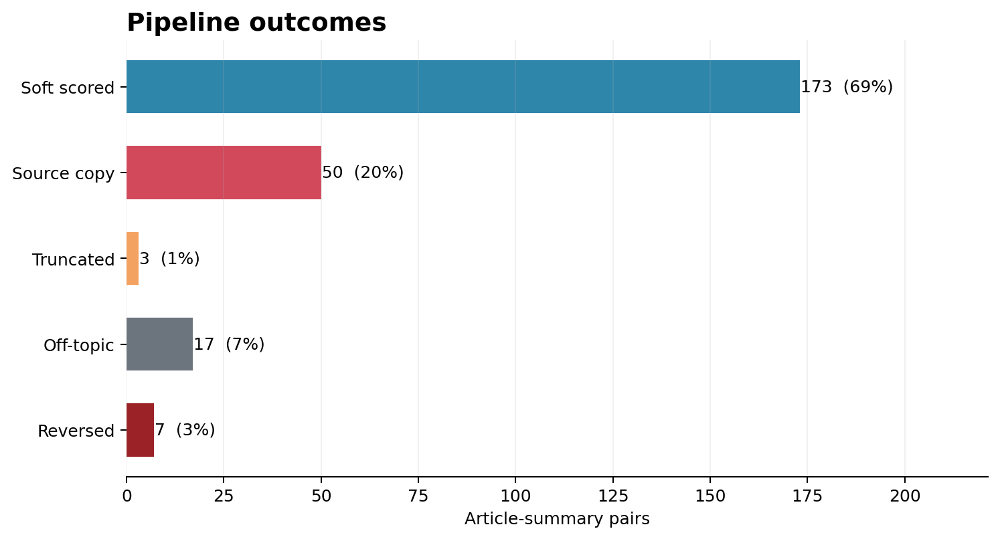
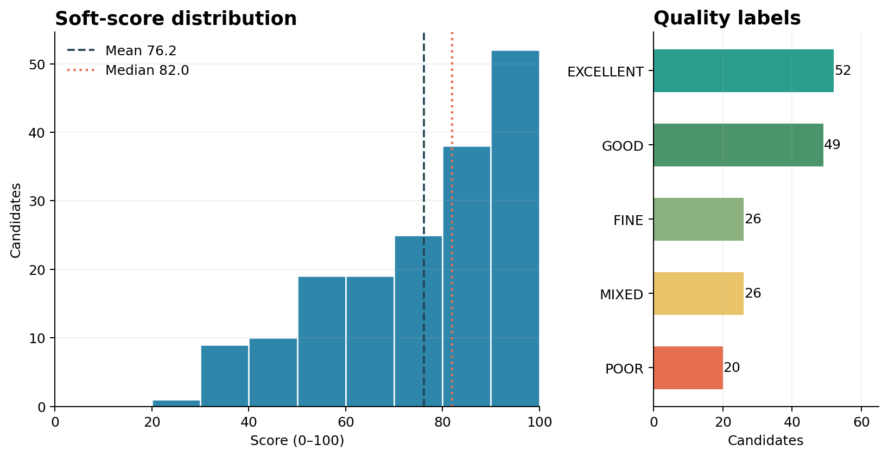
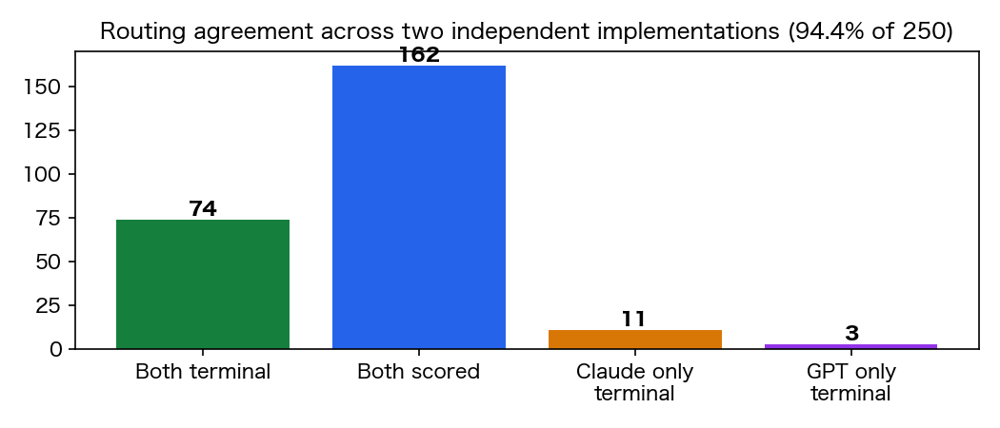
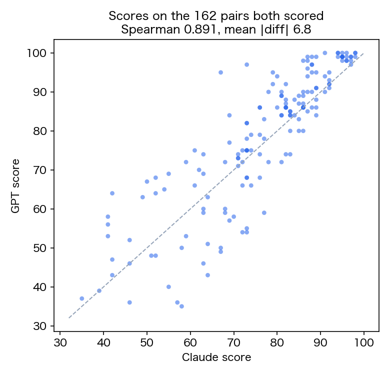

# 摘要质量评估——Codex 中文核对版

## 1. 数据探索

数据集包含 250 个日文新闻文章—候选摘要对：50 篇文章，每篇 5 条候选摘要。任务的核心是对同一篇文章的候选摘要进行排序，而不是孤立地判断某一条摘要是否“好”。查看数据后可以看到几类不同的失败：逐字复制原文、主题完全不相关、颠倒文章的核心事件、虚构核心事实、不可用的截断片段，以及虽然围绕主题但实体、数字或事实错误的摘要。

因此我们采用漏斗式评估，而不是单一相似度分数。复制原文的摘要可能具有很高的词面或 embedding 相似度，但并不完成摘要任务；反过来，忠实的改写也可能与原文词面重叠很低。所以字符串证据只用于最前面能够确定的失败，语义评分只留给通过硬约束的候选摘要。

## 2. 评估设计

运行时只向系统提供文章和候选摘要，不提供 reference summary。文章标题和正文是事实依据。本设计通过 Codex 的 `summary-quality-funnel` plugin 和 `/summary-quality-funnel:evaluate-summary-quality` 斜杠命令执行，而不是作为独立评分脚本运行。

流程如下：

1. **物理硬门禁。** 使用确定性检查识别空输入、逐字复制原文和明显不可用的截断。这些记录在进入昂贵的模型调用前就停止。
2. **指定文章的 embedding 提示。** 本地 embedding 模型只比较候选摘要与它被分配的那篇文章。它只是提示信号：低相似度会提名“可能不相关”，但 embedding 本身不会终止记录。
3. **Grounding Gate Agent。** 独立 Codex agent 判断候选摘要是否有文章依据。当核心内容完全无关或颠倒文章核心事实时，可以提议 `OFF_TOPIC` 或 `FACTUAL_REVERSAL`。该 gate 不打分；必须由独立 Reviewer 重新核实证据后才接受终止。
4. **软评分。** Scorer 为每篇文章生成只基于文章的 anchor，并从四个维度打分：faithfulness（50 分）、coverage（30 分）、coherence（15 分）和 conciseness（5 分）。anchor 只是辅助覆盖度判断，不是真值。每个原子 claim 都记录来源证据，并标记为 supported、contradicted 或 not-in-source。
5. **复核与修订。** 每个分数都由独立 Reviewer 复核。若 Reviewer 返回 `REVISE`，允许 Scorer 做一次有边界的修订，然后再进行最终复核。本次运行没有遗留升级案例。

最终分数在每篇文章内部进行排序。明确复制原文或完全无关的摘要不能因为与文章相似而排在可信摘要之前。

可编辑设计图见 [`diagrams/pipeline.drawio`](diagrams/pipeline.drawio) 和 [`diagrams/funnel.drawio`](diagrams/funnel.drawio)，渲染预览见同目录的 PNG 文件。

## 3. 验证与结果

完整运行处理了全部 250 条数据，并且每 50 篇文章都恰好生成 5 条记录。最终 JSONL 通过了 schema 校验、维度算术校验、证据检查和排序分组检查。250 条记录全部获得独立 Reviewer 的最终批准；173 条软评分记录中有 155 条需要一次修订，没有记录保持在 escalated 状态。

漏斗结果如下：

- 173 条候选摘要完成软评分；
- 77 条提前终止：50 条逐字复制原文、17 条完全无关、7 条颠倒核心事实、3 条不可用截断；
- embedding 提名了 19 条可能无关的摘要，Reviewer 确认 17 条、拒绝 2 条；
- 软评分平均值 76.15，中位数 82，范围 28–100；
- 标签分布：EXCELLENT 52、GOOD 49、FINE 26、MIXED 26、POOR 20。

软评分记录的维度平均值为：faithfulness 37.44/50、coverage 20.02/30、coherence 13.88/15、conciseness 4.81/5。逐字复制是最大的终止类别，这说明词面相似度不能作为最终目标。embedding 与 Reviewer 的两阶段设计也说明 embedding 更适合作为节省成本的提名信号，而不是自动质量判断。

这次实验说明实现已经可以运行，并且为每篇文章生成了有区分度的五路排序。但它不能证明每一个排序都符合人工判断：数据没有独立人工标注集，评估器本身也使用了模型辅助。

## 4. 与独立 Claude Plugin 的交叉验证

为了检验结果是否依赖某一个模型或某一套 prompt，同样的 250 条数据也由 Claude 的 `summary-quality-funnel` plugin 独立评估，并通过 `/summary-quality-funnel:evaluate-summaries` 启动。两个实现的评分阶段互相看不到对方输出，也都没有在运行时接收 reference summary。交叉比较只在两个 plugin 都完成并生成最终 score JSONL 后进行。

两个实现对 250 条记录的路由有 **236/250（94.4%）** 一致：其中 74 条都被判为 terminal，162 条都进入软评分。在共同判为 terminal 的 74 条中，终止类别一致率为 **74/74（100%）**。在两个实现都进行软评分的 162 条上，Spearman 相关系数为 **0.8907**，平均绝对分差为 **6.85 分**（Claude 平均 76.27，Codex 平均 78.23）。

有 14 条路由不一致：Claude 独立终止 11 条（6 条核心事实颠倒、1 条虚构、4 条截断），Codex 独立终止 3 条（2 条截断、1 条完全无关）。离线弱标签检查中，两个实现都识别了 50 条原文复制和 16 条完全无关。剩余不确定性主要集中在 generated 类别：Claude 终止 14/108，Codex 终止 8/108，这正是下一步需要盲法人工标注的部分。

两个独立 plugin 在主要路由和分数排序上的一致性，支持该漏斗设计不是某一个 agent 偶然产生的结果。但这仍不等于客观正确性：两个系统共享相同的 rubric 和数据，也可能共享相同的盲点。

## 5. 局限与下一步

最大局限是缺少独立的逐条人工标签。Reviewer 的一致批准证明的是内部审计完成，不是模型判断一定符合专家读者。数据也只有一个语言、一个新闻领域和 50 篇文章；换到其他领域、长度和写作风格时，阈值可能变化。embedding 只作为指定文章相关性证据运行，并没有被校准为概率。article-only anchor 也可能遗漏人类认为重要的事实，因此 coverage 仍然是判断性指标，而不是 reference-match 指标。

下一步应对分层抽样子集进行盲法人工标注，测量成对排序准确率和校准度；测试多语言和非新闻数据；并做有无 embedding 的消融实验。在改变终止策略或宣称可用于生产前，应使用独立的 held-out 阈值集。

## 结论

Codex 实现是一个可复现、无需运行时 reference 的排序原型：它提前处理硬性违规，把语义计算留给幸存者，并为每个决定保留证据和复核轨迹。在这 250 条数据上，它完成了全部五路排序并获得了完整的内部复核。Claude/Codex 的独立交叉验证结果（94.4% 路由一致、0.8907 分数相关、共同 terminal 类别 100% 一致）支持该设计具有稳定性。但这些结果仍不能证明达到人工水平，也不能证明已经具备生产环境的泛化能力。
