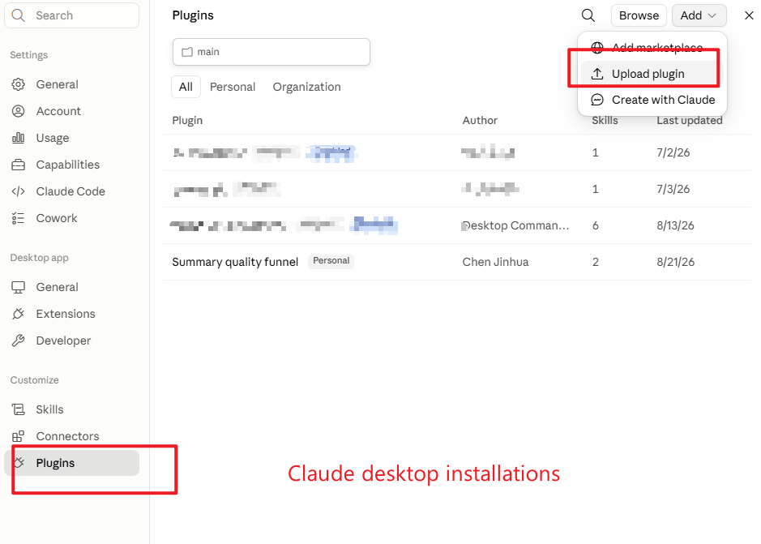
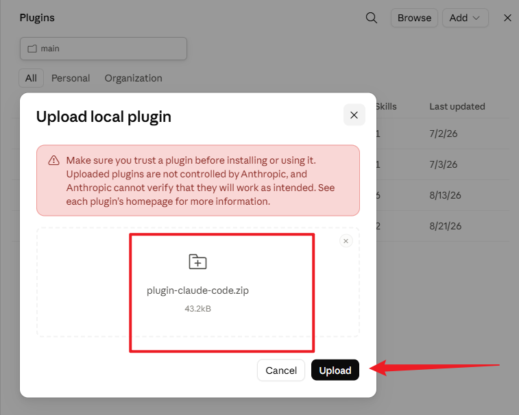
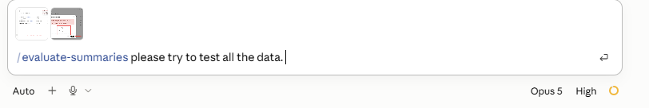
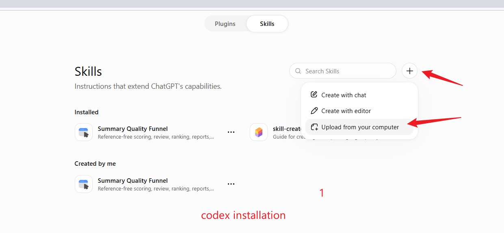
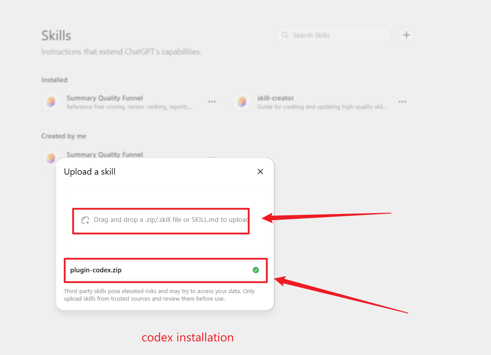
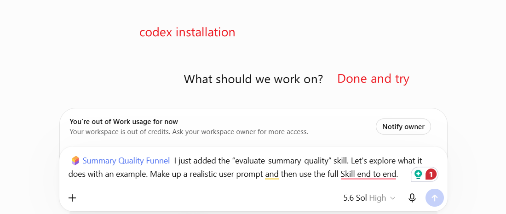

# Reference-Free Summary Quality Evaluation — Submission

Evaluating 250 Japanese news summaries (50 articles × 5 candidates) with a
reference-free funnel that is **delivered as an installable plugin, twice**.
The Claude Code plugin is the primary implementation and produced the
submitted `scores.jsonl`; the Codex plugin is an independent second
implementation of the same design, used as cross-host validation.

```
submission_final/
├── README.md          ← you are here
├── report.pdf         ← THE REPORT — IEEE two-column, 5 pages
├── report-detailed.pdf ← same report, prose left long, 7 pages
├── scores.jsonl       ← 250 rows, one per summary_id
└── code/
    ├── plugin-claude-code.zip   ← upload this to Claude to install the PRIMARY plugin
    ├── plugin-codex.zip         ← same, for the SECONDARY plugin on Codex
    ├── install/                 screenshots of both upload flows, as walked through
    ├── plugins/
    │   ├── a-claude-code/    PRIMARY plugin — installable, produced scores.jsonl
    │   └── b-codex/          SECONDARY plugin — same design, different host
    ├── runs/
    │   ├── primary_claude_full250/    full audit trail of the submitted run
    │   └── secondary_codex_full250/   full audit trail of the second run
    ├── exploration/          probes, their raw outputs, and abandoned prototypes
    ├── validation/           cross-implementation comparison + number verifier
    ├── DESIGN.md             the design specification
    ├── processing.md         Claude-side decision log, dated, including reversals
    └── progressing_GT.md     Codex-side implementation log
```

**The code is the plugin.** There is no separate orchestration script to run;
everything the evaluator does lives inside the two plugin directories.
`code/exploration/` and `code/validation/` hold what surrounds the plugin —
the probes that informed the design and the analysis that checks the output.

Place `submission_final/` beside the assignment's `data/` directory, as in the
provided repository. `data/` is not duplicated here.

---

## Read the report

The report ships in two lengths. Both carry the same title, the same design and
the same numbers; they differ in how much prose surrounds them.

| File | Pages | What it is |
|---|---:|---|
| **`report.pdf`** | **5** | The report. Exploration, Design, Validation, Limitations, Conclusion, in IEEE conference format, with all nine tables and three figures. Read this one. |
| `report-detailed.pdf` | 7 | The same report with the prose left long: fuller exploration narrative, per-table commentary, and the un-compressed Limitations. Read it when a claim in the 5-page version needs its full argument. |

Every table and figure appears in both, and the numbers were checked cell by
cell — the shorter version tightens wording and re-lays out three wide tables
into two side-by-side blocks, it does not drop data.

The two PDFs are the report; there is no other version of it.

---

## Install the primary plugin (Claude Code)

Prerequisites: Claude Code, Python 3.9+, and Ollama serving
`qwen3-embedding:0.6b` locally.

### Option A — upload `code/plugin-claude-code.zip` (no checkout needed)

The steps below are the ones that were actually walked through, not a
description from documentation.

**1. Settings → Plugins → Add → Upload plugin.**



**2. Choose `code/plugin-claude-code.zip` and press Upload.** The dialog shows
43.2 kB, which is the archive as shipped here. It also warns that uploaded
plugins are not controlled by Anthropic and cannot be verified — every file the
plugin runs on is plain text under `code/plugins/a-claude-code/`, so it can be
read before the upload rather than trusted after it.



The plugin itself is the archive root, so the manifest sits where the installer
looks for it:

```
.claude-plugin/plugin.json      ← version 0.2.0
agents/                         ← 5 agents
commands/evaluate-summaries.md  ← 1 command
skills/evaluate-summary-quality/← 1 skill: rubric, few-shot bank, scripts
```

After installing, the plugin list shows it as `Personal`, and its `Skills`
column reads **2** — that column counts the skill directory and the slash
command together. `claude plugin details` gives the full breakdown instead.

**3. Invoke it.** In the desktop app the command is `/evaluate-summaries`; from
the CLI it is namespaced as `/summary-quality-funnel:evaluate-summaries`.



This is the shortest path for a reader who wants to run the evaluator without
cloning anything. `code/plugin-codex.zip` is the counterpart for the secondary
plugin, with `.codex-plugin/plugin.json` at its root; the two are packaged
separately so each host gets only what it can use.

### Option B — install from this directory

```bash
claude plugin marketplace add "<abs-path>/submission_final/code/plugins/a-claude-code"
claude plugin install summary-quality-funnel@local
```

The marketplace points at the working tree, so editing a file in this directory
changes the installed plugin with no sync step. Use this option when you want to
read or modify the agent contracts while running them.

## Reproduce the submitted run

Either option leaves the same plugin installed. From the repository root
(`/evaluate-summaries` in the desktop app):

```
/summary-quality-funnel:evaluate-summaries data/articles.jsonl data/summaries.jsonl;
evaluate all 250 pairs, rank five candidates per article, and write
score.jsonl and report.md
```

The command loads the skill, runs the deterministic scripts, launches the four
isolated agents (Grounding Gate, Scorer, Reviewer, Reporter), validates the
result against the schema, ranks candidates within each article, and writes
the report. Runtime input is only the assigned article and the candidate;
`reference_summary` is reachable by exactly one role, the Reporter, and only
after every score is final.

Verify the install with `claude plugin validate` and `claude plugin details`
(expected: version 0.2.0, 5 agents, 1 skill, 1 command — the fifth agent is the
corpus-blind Reviewer discussed in the report's Limitations, shipped but unused
by the submitted run).

## Install and run the secondary plugin (Codex)

Upload `code/plugin-codex.zip` as a skill. The steps below are the ones that
were actually walked through, not a description from documentation.

**1. Skills → `+` → Upload from your computer.**



**2. Drop `code/plugin-codex.zip` into the upload dialog.** The dialog accepts a
`.zip`, a `.skill`, or a bare `SKILL.md`; the zip is the whole skill, so use it.
A green check means the archive was accepted. The dialog also warns that
third-party skills can reach your data — the plugin's rubric, agent contracts
and scripts are all plain files under `code/plugins/b-codex/`, so they can be
read before the upload rather than trusted after it.



**3. Start the run.** Attach the installed skill and drive it end to end:



```
/summary-quality-funnel:evaluate-summary-quality data/articles.jsonl data/summaries.jsonl;
evaluate the full 250-pair dataset and produce ranked score JSONL and a report
```

The same skill can also be installed from the working tree at
`code/plugins/b-codex/summary-quality-funnel` when you want to edit the agent
contracts while running them.

This run is not needed to reproduce `scores.jsonl`. It exists so the design can
be checked against an implementation that shares no code path with the primary
one.

---

## `scores.jsonl` format

One JSON object per line, 250 lines, one per `summary_id`. Fields:

| Field | Meaning |
|---|---|
| `summary_id`, `article_id` | identifiers from `data/summaries.jsonl` |
| `score` | **0–100 integer. This is the score field.** Terminal outcomes are 0 |
| `quality_label` | `EXCELLENT` 90–100 · `GOOD` 75–89 · `FINE` 65–74 · `MIXED` 50–64 · `POOR` 0–49 |
| `terminal_result` | `null`, or one of the seven terminal categories |
| `terminal_rank` | severity tier for terminals: 0 worst → 3 |
| `rank_within_article` | 1–5, position among the article's five candidates |
| `eligible_for_soft_scoring` | whether the candidate reached the graded stage |
| `dimensions` | `faithfulness` /50, `coverage` /30, `coherence` /15, `conciseness` /5 — these sum to `score` exactly |
| `anchor` | article-only main event, key facts, anchor summary (graded rows) |
| `claim_checks` | each atomic claim with `SUPPORTED` / `NOT_IN_SOURCE` / `CONTRADICTED` and the article span cited |
| `issues` | scorer notes, including terminals considered and rejected |
| `review` | independent Reviewer decision, rounds, confidence, findings |
| `evaluation_trace` | every stage visited, with the evidence it produced |

Terminal categories and tiers: `OFF_TOPIC`, `FACTUAL_REVERSAL`,
`FABRICATED_CONTENT`, `EMPTY_OUTPUT` (tier 0) · `VERBATIM_SOURCE_COPY`
(tier 1) · `OBVIOUS_TRUNCATION` (tier 2) · `OVER_SENTENCE_LIMIT` (tier 3).
All terminals score 0 but keep distinct tiers so five candidates stay
orderable even when several of them fail.

Comparability: scores are absolute (0–100) and are produced from the
`(article, candidate)` pair alone, so they compare across articles;
`rank_within_article` gives the within-article ordering directly.

---

## Reproduce the validation

Every number quoted in the report is re-derived from the shipped artifacts:

```bash
cd code/validation
python3 verify_report_numbers.py          # 199 checks, exits non-zero if any moves
```

It reads only `data/`, the two run files and the third-read file — no model, no
network. It re-derives the weak labels from the corpus by string comparison, so
no evaluator output can influence a label.

The cross-implementation comparison that Section III-F reports:

```bash
python3 compare_implementations.py \
  --claude ../runs/primary_claude_full250/score_ranked.jsonl \
  --gpt    ../runs/secondary_codex_full250/score_ranked.jsonl \
  --articles ../../../data/articles.jsonl \
  --summaries ../../../data/summaries.jsonl \
  --outdir .
```

Both comparisons run **after** scoring. Neither implementation read the
other's output, and neither read a reference summary at runtime.

`code/validation/third_read_109_unlabelled/` holds the third independent
scoring of the 109 candidates that carry no derivable ground truth, together
with its agreement file.

---

## How I used AI tools

Permitted and used heavily; the split is worth stating precisely.

**Mine.** The production constraint (reference-free, one article + one
candidate, no corpus). The decision to read candidates inside their articles
rather than as a flat list, which is what exposed the five populations. The
hard/soft split, and then the split of hard constraints into a physical layer
and a semantic layer once I found that reversals pass every cheap check. The
rule that a reversal or fabrication is terminal while a peripheral error stays
in the gradient — and the centrality boundary that keeps that rule from
swallowing the rubric. The dimension weights. The requirement that no stage may
terminate without independent review. The rejection of batch-relative
relevance evidence as inadmissible at runtime. The choice to ship the design as
a plugin, twice, and to use the second implementation as validation rather than
as a fallback. The validation strategy, including the decision to score the
109 unlabelled candidates a third time because agreement on the labellable 141
was the wrong number to report alone.

**AI-assisted.** Claude Code and Codex executed the isolated Grounding Gate,
Scorer, Reviewer and Reporter roles that produce the actual judgements; wrote
the deterministic scripts, validators and chart code; drafted few-shot examples
against my specifications; and helped draft this report from the run
artifacts. A local model was used only for embeddings
(`qwen3-embedding:0.6b`), never for generation.

**Interactions that materially changed the result.** Three, all recorded with
dates in `code/processing.md`: (1) an early design used `reference_summary` as
a runtime comparator — I rejected it, which turned the architecture from a
reference-based ensemble into a reference-free funnel; (2) the first
`FACTUAL_REVERSAL` implementation routed reversals through soft scoring — I
rejected it, which produced the Grounding Gate as a separate pre-scoring agent;
(3) a smoke test on one truncated candidate produced a Reviewer verdict that
was *well-argued and factually wrong*, which is what established that part of
the truncation class is undecidable under a reference-free contract rather than
a detector bug. That finding is in the report's Limitations because it is a
limit of the contract, not of the implementation.

The logs in `code/processing.md` and `code/progressing_GT.md` are the working
record, including the decisions that were later reversed.
