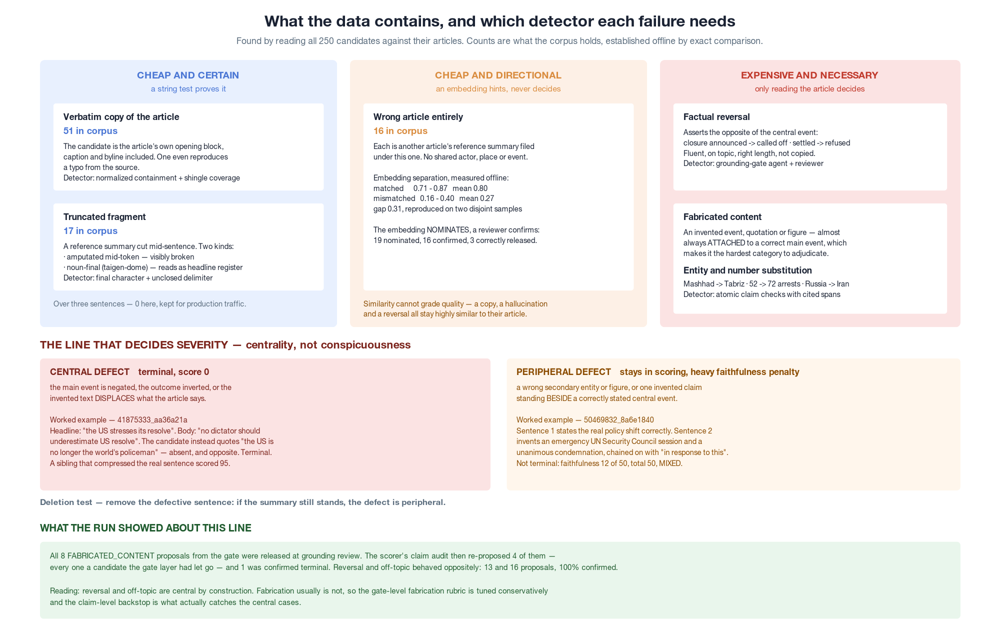
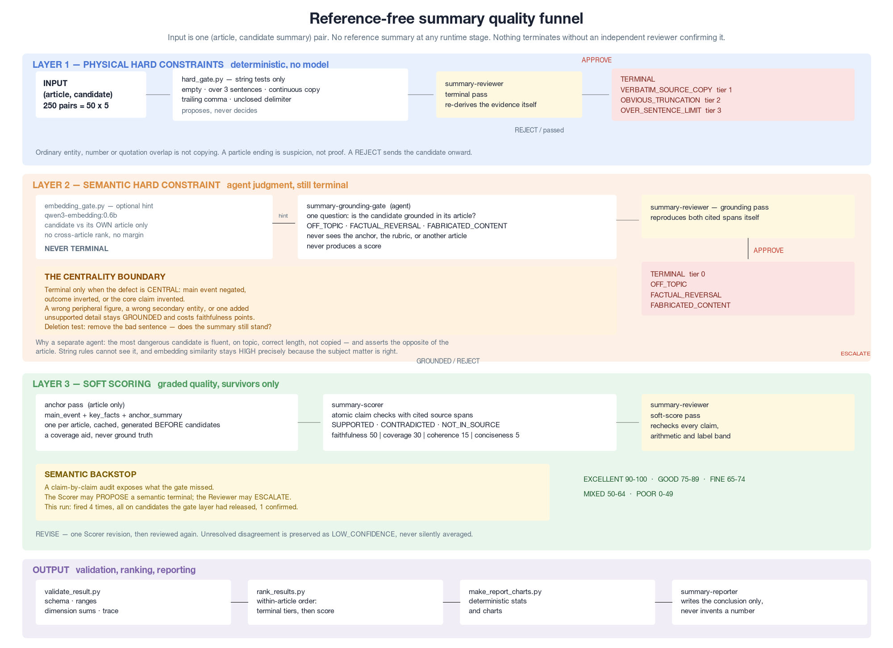
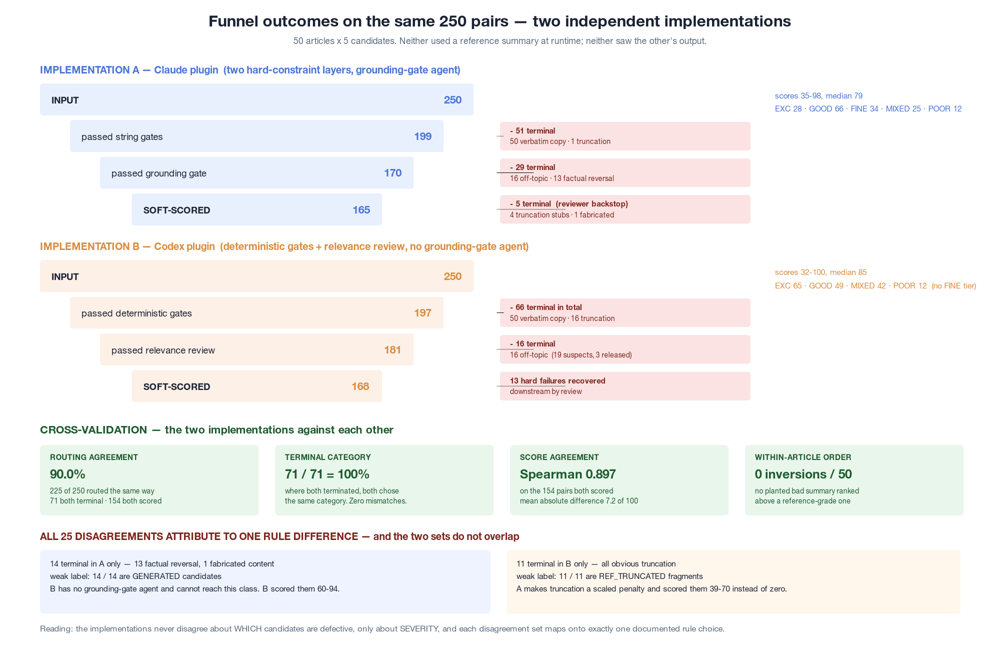

# 日语新闻摘要器的质量评估

一套不依赖参考答案的质量漏斗——建了两遍,然后拿它们互相检验。

---

## 1. 探索

语料是 50 篇 BBC 日语文章、每篇 5 条候选摘要,共 250 条,生成方法不公开。我没有抽样,而是把 250 条逐一对照原文读完——因为真正要命的失败,在汇总统计里是看不见的。

**表面能告诉你什么,又在哪里失效。** 单靠精确字符串比对就能落下三类:51 条原样复制了文章开头整块(图片说明、记者署名一并抄进去,其中一条连原文自带的错别字都照抄);17 条是参考答案被从句子中间剪断的片段;16 条是**别的文章**的参考答案被归到了这篇名下。250 条里有 84 条,靠字符串检测加一次相似度检查就定了性,全程没有模型判断参与。

剩下 166 条才是问题真正所在。逐条读下来暴露出一类表面手段完全够不着的候选:**流畅、长度合规、话题正确、没有抄袭——而且是错的**。`52000333_4f9df41b` 报道全面封锁被取消,而原文宣布的是实施;`44708203_437c2afb` 描述获救少年"衰弱严重",而原文写的是他们面带笑容做自我介绍;`50469832_8a6e1840` 把真实的政策转变陈述得完全正确,然后接上一段原文根本不存在的"联合国安理会紧急会合并全票通过谴责决议"。

**两个假设死在这里。** 第一个是"用嵌入相似度给质量打分"。它做不到,而且**错的方向很关键**:逐字照抄的候选相似度**最高**,因为复制会把相似度顶满。相似度是话题信号,而上面每一条危险候选的话题都是对的。第二个是"用参考答案当比较基准"。生产环境的一次请求里只有一篇文章和一条候选,别的什么都没有;一个需要参考答案才能工作的评估器,等于根本没被评估过。这两个假设都被早早放弃,第二个直接重塑了整个架构。

**活下来的**是一个关于严重程度的区分,它后来成了整个设计的枢轴。`50469832_8a6e1840` 编造了安理会决议,但主事件陈述正确——把那句编造删掉,摘要依然立得住。`41875333_aa36a21a` 把一句真实引语替换成了意思相反的编造引语——删掉之后什么正确的东西都不剩。两者都是编造,但只有一个摧毁了输出。**显眼不等于严重,中心性才是。**

*[可编辑源文件: `figures/failure_modes.drawio`]*

## 2. 设计

三层,从最便宜的开始,而且**任何终止都必须由独立复核者确认**。

**第一层,物理层。** 脚本只提出字符串检测能证明的事:空输出、超过三句、连续照抄原文、结尾逗号或未闭合的括号引号。它只提议,从不定夺。

**第二层,语义层。** 一个专职的 Grounding Gate agent 只回答一个问题——这条候选是否扎根于它的文章?——返回 `OFF_TOPIC` / `FACTUAL_REVERSAL` / `FABRICATED_CONTENT`,并从两边文本各引一段。它看不到锚点、看不到评分细则、看不到任何别的文章,也从不打分。这种隔离是刻意的:**一个既负责筛查又负责打分的 agent,会把中心缺陷折算成一个低分,而不是把它拦下来。** 在它之前跑一次嵌入检查作为廉价提示,只把候选和它自己所属的文章比,并且永远不能单独构成终止。

**第三层,软评分。** 幸存者先拿到一份只看文章生成的锚点(主事件、关键事实),然后做原子 claim 核查并引用原文片段,最后四个维度打分:忠实性 50、覆盖度 30、连贯性 15、简洁性 5。

**中心性边界**决定一个缺陷归哪一层管。主事件被否定、结论被颠倒、核心主张是编造的 → 终止。次要实体错、外围数字错、或者在正确的中心事件旁边多加了一条编造主张 → 扣忠实性分。可操作的判据是**删除测试**:把有问题的那句删掉,如果摘要依然成立,这个缺陷就是外围的。

**被否决的备选方案。** Cross-encoder reranker:它回答的是相关性,而我们的问题是"相关/不相关"的粗二分,一个 0.6B 的嵌入模型已经把两组在余弦上拉开了 0.31,再加它就是多一个 2GB 依赖、零信息增量。BM25:字符级复制率用确定性方法覆盖了同一片地。把锚点嵌入当评分特征:量过了,结果混杂,弃用。固定扣 25% 的抄袭罚则:作业里没有依据,撤回。

*[可编辑源文件: `figures/funnel_architecture.drawio`]*

## 3. 验证

我把同一套设计实现了两遍——一遍做成 Claude 插件,一遍做成 GPT/Codex 插件——各自跑完全部 250 条。两边运行时都不使用参考答案,也都看不到对方的输出。以下是四条独立的证据线。

**对照弱标签。** 植入类别是在两次运行都定稿之后,仅从语料本身离线推导出来的。141 条可判定记录的一致率:**129/141 = 91.5%**。照抄 50/50,跑题 16/16,参考答案级别的候选 58/58 全部被正确保留,均分 78.6。

**篇内排序。** 全部 50 篇文章,**零倒置**——没有任何一条植入的劣化摘要排在参考答案级别的候选之上。58 条参考答案原样的候选,在 96.6% 的文章里落在第 1 或第 2 名;少数被生成式摘要挤下来的场合,挤它的是真正写得好的摘要,从来不是有缺陷的。

**两套实现之间。** 路由判定(终止 vs 评分)一致率 **90.0%**(225/250)。两边都判终止的场合,**终止类别 71/71 = 100% 相同**。两边都给分的 154 条,Spearman **0.897**,平均绝对差 7.2 分(满分 100)。

那 25 条分歧是本报告中最有信息量的结果,**因为两个分歧集合完全不重叠**。仅实现 A 终止的 14 条全是事实反转或编造,而且 14 条**全部**是 `GENERATED` 候选——实现 B 没有 grounding gate agent,结构上根本够不到这一类。仅实现 B 终止的 11 条全是截断,而且 11 条**全部**是 `REF_TRUNCATED` 片段——实现 A 把截断改成了按比例扣分,给了它们 39–70 分而不是零分。**两套实现从不分歧于"哪些候选有缺陷",只分歧于"有多严重",而且每一组分歧都精确对应一条成文的规则选择。**

**内部信度。** 语料里含有 6 对字节完全相同的候选。由不同 agent 独立评分后,**6/6 得分完全一致**——一次计划外的重测信度检验。另外,170 份评分草稿的四维加和零错误,250 条最终记录全部通过 schema 校验。

*[可编辑源文件: `figures/funnel_results.drawio`]*

## 4. 局限

**109 条候选没有任何 ground truth。** 生成式候选占语料的 43%,弱标签检验完全够不到它们。那个 91.5% 只描述了有标签的那部分。

**编造类的判定不一致。** gate 层提出的 8 条 `FABRICATED_CONTENT` 在复核阶段无一被确认;claim 层的后备防线随后重新提出了其中 4 条,最终 1 条被确认终止。而反转和跑题的确认率都是 100%。这个类别是真实存在的,但阈值不稳定,复核者用 MEDIUM 置信度如实标记了这些判断——是标出来,不是藏起来。

**有些截断在原理上不可判定。** `〜を発表` 既是合法的日语标题体言止め,也可能是 `〜を発表した。` 被剪掉之后的残留。**区分两者的唯一依据是被删掉的那段文字,而一个不依赖参考答案的评估器手里正好没有它。** 这是契约本身的边界,不是漏斗的缺陷。

**"够不到参考答案"目前靠约定保证,不靠构造保证。** 复核者的输入里确实没有参考答案字段,但磁盘上的语料里有,而复核者持有文件读取工具。**除了 prompt,没有任何东西拦着它。** 一个无文件权限的 corpus-blind 复核者已经写好并提交,但尚未启用;下一版应当用它重裁那 85 条终止判定并报告 delta。在那个数字出现之前,任何关于"生产形态复核"的说法都不成立。

**下一步,按优先级:** 把截断规则与其标签定义对齐后重测;用 blind 复核者跑一遍终止集合;为那 109 条无标签候选取得人工排序;在更换模型、语言或领域之前重新校准 0.50 这个相似度阈值。

**结论:一个失败模式被异常清晰地刻画过的可用原型,而不是一个经过验证的生产级评估器。**
